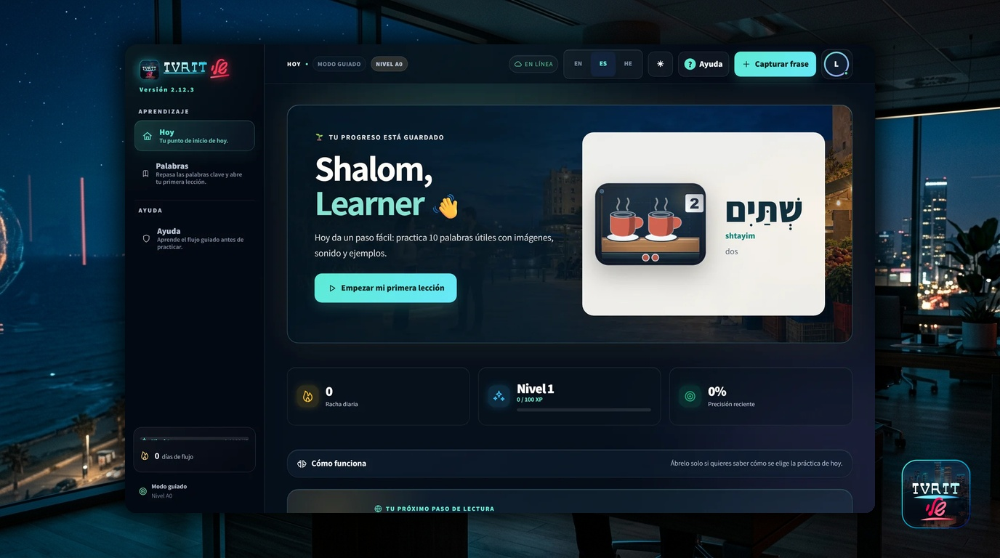
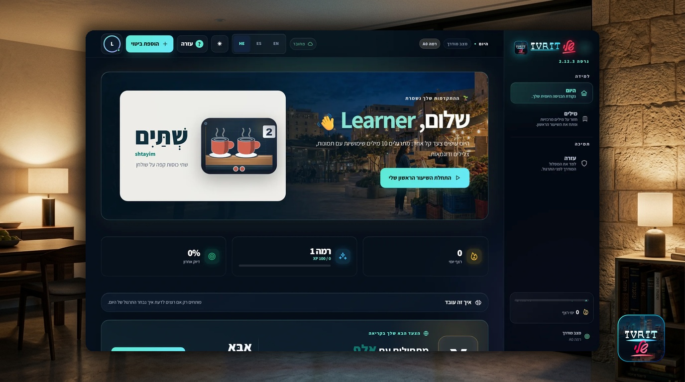
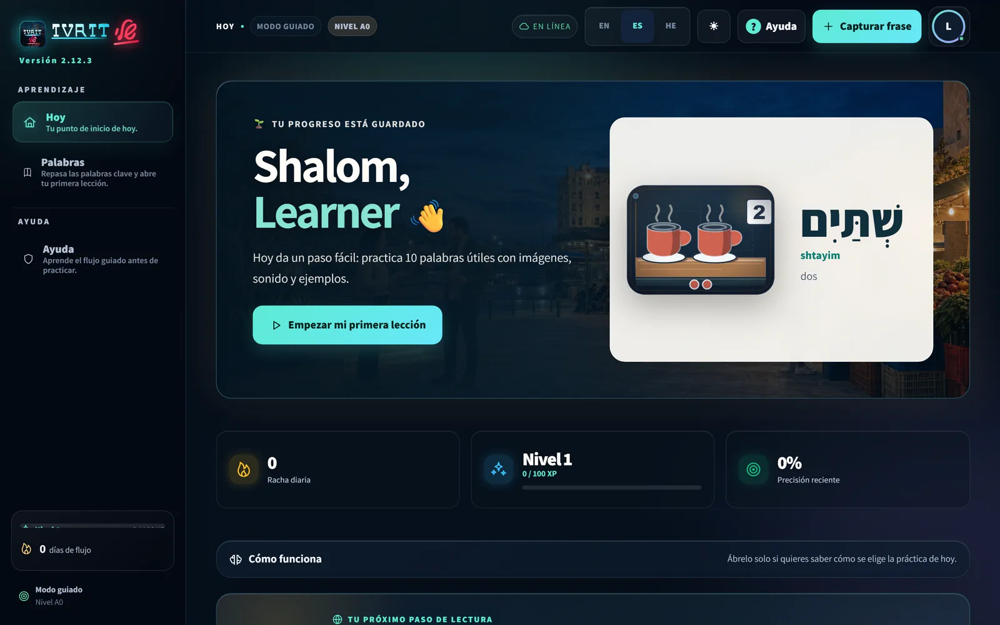
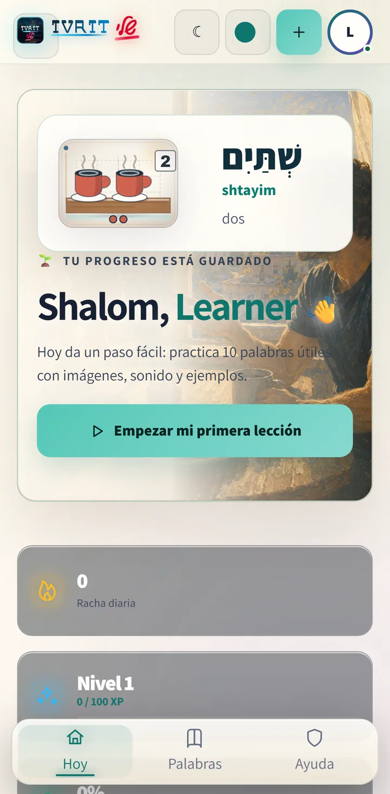
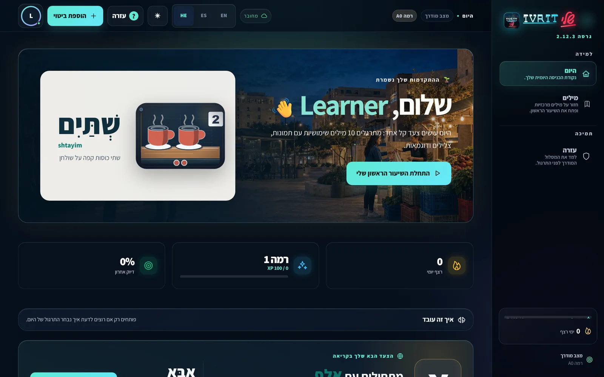
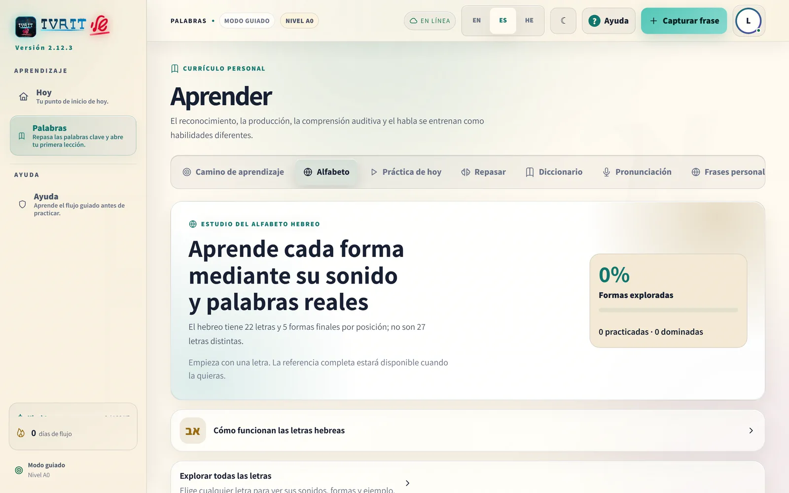
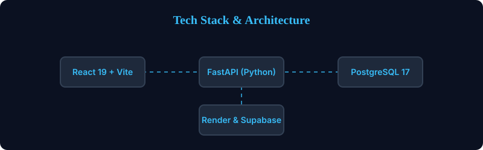

  

  <h1>Ivrit Sheli 2.12.3 — El hebreo vivo de cada día</h1>
  
<strong>A trilingual, local-first PWA for learning the Hebrew people meet in everyday life.</strong>

  
Guided enough for a complete beginner, deep enough to keep growing.

  

    
    
    
    
    
  

  

    
    
  

 

> **The Living Hebrew Journey** — explore a beautifully crafted, evidence-based learning environment with 240 exact semantic scenes that adapts to your language, your pacing, and your daily life in Israel. Privacy is built-in; your progress stays local by default until you decide to back it up.

## 🏛️ Learning Hubs & Experience Depth

  

The platform is organized into living, stable learning hubs. Their visible names prioritize clear actions, while internal routes provide semantic stability:

- **Today (היום)** — Your daily starting point. Actionable phrases, retention algorithms, and daily flow.
- **Alphabet Studio** — Foundation building. 22 base letters, 5 final forms, and vowel maps.
- **Dictionary (מילון)** — Your semantic anchor. Root-based connections, exact trilingual translations, and audio.
- **AI Coach (Beta)** — Real-time conversation simulation and grammatical feedback driven by offline-capable models.
- **Settings** — Deep personalization. Switch between 14 aesthetic themes, toggle RTL interfaces, and manage your local data vault.

Three persistent depths change how information is presented without hiding rooms or confusing the learner:

- **Guided** — uses simpler language, removes complex grammatical terms, and keeps context visible.
- **Explorer** — the balanced default: a calm, self-directed visit.
- **Deep Dive** — exposes linguistic roots, transliteration details, exact stats, and advanced controls.

## 🌍 Language, Themes and Accessibility

  

  

- **Trilingual Core:** English, Spanish, and Hebrew interfaces working seamlessly together.
- **RTL Architecture:** Genuine Right-to-Left document direction and `he-IL` formatting that respects the language.
- **Expressive Aesthetics:** 14 distinct dark and light themes. 
- **Accessibility First:** Keyboard-aware navigation, focus restoration, and mobile drawer behavior.
- **Motion Polish:** Reduced-motion support across application transitions, elegant charts, and static repository artwork.

---

## 🚀 Live Staging & Deployment

  

This is the **verified 2.12.3 release**. The application is now publicly deployed and verified on Render with Supabase.

**Current private candidate:** `2.12.3`
**Latest published release:** `v2.12.2`
*Note: Although live on staging, officially no durable hosted demo is currently verified by the strict candidate rules.*

| Component | Status | Details |
|---|---|---|
| **Web Service** | 🟢 Live | [ivrit-sheli-staging.onrender.com](https://ivrit-sheli-staging.onrender.com) (Render Free) |
| **Database** | 🟢 Live | Supabase PostgreSQL 17 via IPv4 Session Pooler (`port 6543`) |
| **Authentication** | 🟢 Live | Google OAuth 2.0 with strict origin validation |
| **Source Release** | `v2.12.3` | Exact immutable source checkpoint |

## 📸 2.12.3 Visual Proof

  

  

<em>An eight-second, non-looping tour built from four privacy-reviewed 2.12.3 candidate captures.</em>

<table>
  <tr>
    <td width="40%" align="center"><strong>Responsive mobile flow</strong></td>
    <td width="60%" align="center"><strong>Real Hebrew RTL layout</strong></td>
  </tr>
  <tr>
    <td></td>
    <td></td>
  </tr>
</table>

<table>
  <tr>
    <td width="50%" align="center"><strong>Alphabet Studio</strong></td>
    <td width="50%" align="center"><strong>Linked dictionary</strong></td>
  </tr>
  <tr>
    <td></td>
    <td></td>
  </tr>
</table>

These five WebP assets were captured on 2026-08-27 Asia/Jerusalem from a fresh,
generic local learner with no personal progress. Every image was reviewed at
full size, at GitHub display scale and in grayscale. The GIF was rendered twice
to byte-identical output, checked at four representative frames, and contains
no loop extension. Hashes, physical dimensions, source PNG hashes, locale,
direction, viewport, timestamps, privacy findings, process provenance and the
dirty-tree boundary are recorded in the
[`2.12.3 candidate visual-proof manifest`](assets/readme/proof/2.12.3/manifest.json).
The immutable
[`2.12.2 published visual record`](assets/readme/proof/2.12.2/manifest.json)
remains preserved separately; the older 17-PNG candidate set is not presented
as current proof.

## ⚡ Tech Stack & Architecture

  

Ivrit Sheli is designed as a local-first offline-capable PWA with a resilient cloud backup backend.

- **Frontend:** React 19, TypeScript, Vite, IndexedDB (Dexie) for local-first storage.
- **Styling:** Vanilla CSS variables, responsive fluid typography, and native RTL logic (`dir="rtl"`).
- **Backend:** FastAPI, Python 3.12, SQLModel (Pydantic), strict OAuth2 stateless sessions.
- **Database:** SQLite (local offline mode) & PostgreSQL 17 (Cloud sync).
- **Infra:** Docker, Render (Live Web Service), Supabase (PostgreSQL with IPv4 Session Pooler).
- **Testing:** 1000+ automated tests across Playwright, Vitest, and Pytest.

## 📚 Documentation

For deep technical dives, deployment runbooks, or local installation, please refer to the dedicated documentation:

- [🚀 Installation Guide (INSTALL.md)](docs/INSTALL.md)
- [🎨 Visual Bible & Brand](docs/VISUAL_BIBLE.md)
- [🏗️ Architecture Deep Dive](docs/ARCHITECTURE.md)
- [🌐 Live Deployment Rules](docs/DEPLOYMENT.md)
- [🔒 Privacy & Data Ownership](PRIVACY.md)
- [🧪 Test Reports](TEST_REPORT.md)

## 👤 Author and License

Built with ❤️ by **Kevin Cusnir / [Lirioth Teltanion](https://github.com/LiriothTeltanion)**.
Released under the [MIT License](LICENSE).
