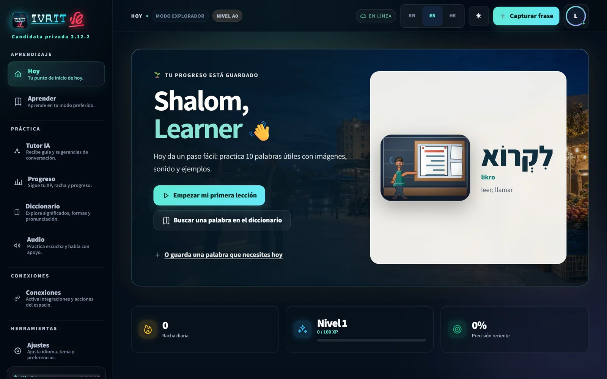
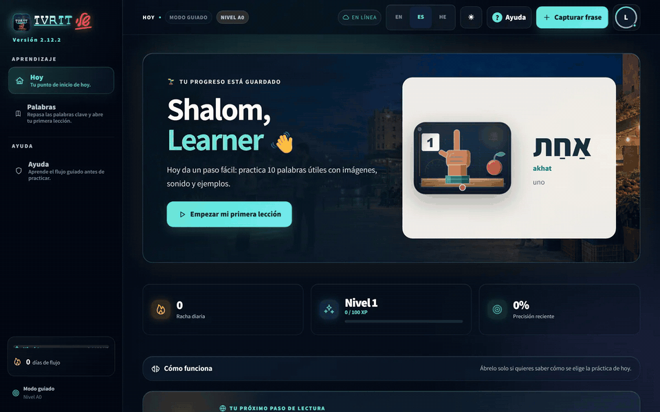
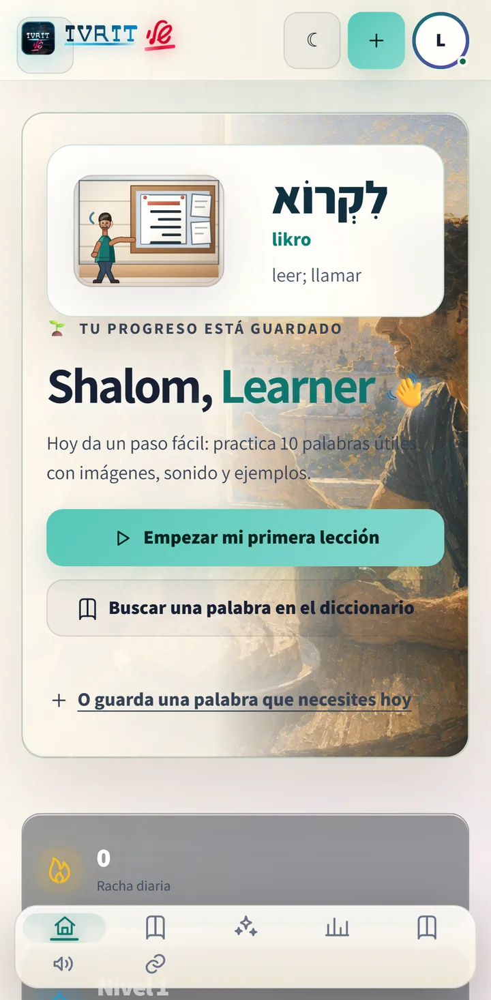
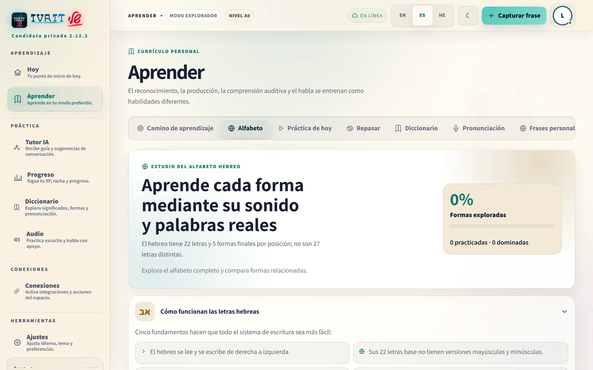
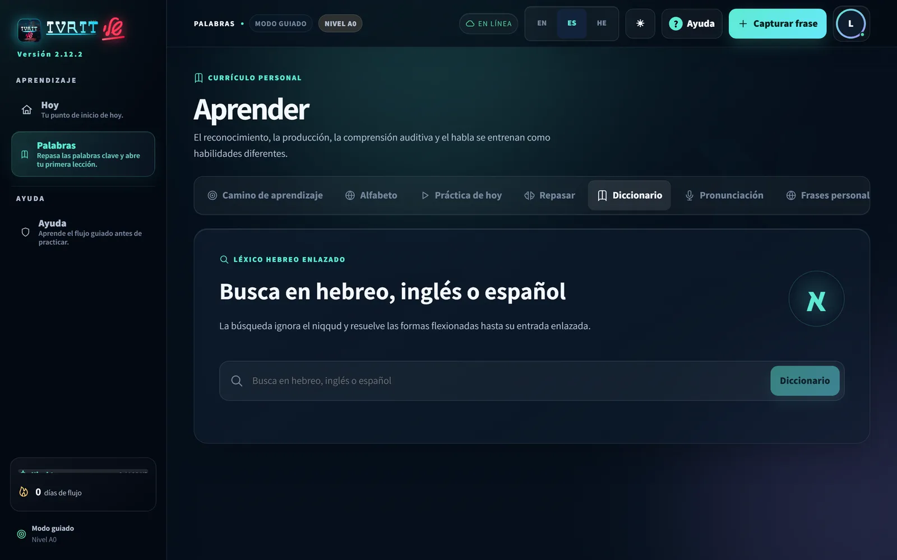
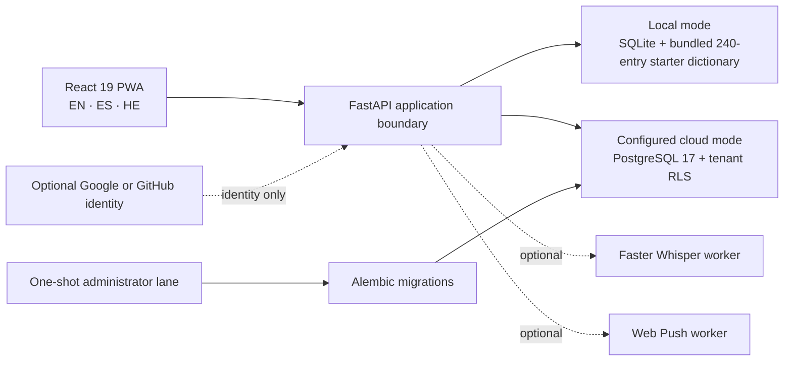

<div align="center">
  

  <h1>Ivrit Sheli 2.12.2 — Visual Harmony &amp; Resilience</h1>
  <p><strong>A trilingual, local-first PWA for learning the Hebrew people meet in everyday life.</strong></p>
  <p>Guided enough for a complete beginner, deep enough to keep growing.</p>

  <p>
    <code>React 19 + TypeScript</code> ·
    <code>FastAPI + Python</code> ·
    <code>EN / ES / HE</code> ·
    <code>RTL-native</code> ·
    <code>SQLite / PostgreSQL 17</code> ·
    <code>Docker</code>
  </p>
</div>

> [!IMPORTANT]
> This checkout is the **published [v2.12.2 source release](https://github.com/LiriothTeltanion/IvritSheli/releases/tag/v2.12.2)**.
> It advances the repository, tag, and GitHub Release—not a hosted service.
> **No verified durable hosted demo is currently available.** The images and
> checks below are local served-runtime evidence; they are not deployment,
> provider-availability, or real-user acceptance claims.

## Current status

| Surface | Evidence-backed state |
|---|---|
| Published source | `v2.12.2` — Visual Harmony & Resilience, published 2026-08-27 |
| Latest published version | [`v2.12.2`](https://github.com/LiriothTeltanion/IvritSheli/releases/tag/v2.12.2) on `main` |
| Durable hosted demo | Unavailable; the historical Railway service returned HTTP 404 when checked on 2026-08-26 |
| Current visual proof | Privacy-reviewed captures from the locally served FastAPI/SQLite 2.12.2 release code; exact provenance and hashes are recorded below |
| Current source-release test record | 363 backend + 858 frontend = 1,221 component/integration passes, plus 35 Playwright cases and 4 capture contracts; see [`TEST_REPORT.md`](TEST_REPORT.md) |
| Historical hosted record | `v2.4.0`: 213 unique automated tests and dated Railway/PostgreSQL evidence; preserved as history, not current availability |
| Publication actions in this work | Fast-forward of `main`, annotated `v2.12.2` tag, and GitHub Release only — no deployment, database, OAuth, provider, or Devpost change |

The machine-readable version/publication contract lives in
[`portfolio/project.json`](portfolio/project.json). It deliberately separates
source version, historical release evidence, and current hosting availability.

## Current visual proof

<p align="center">
  
</p>

<p align="center">
  
</p>
<p align="center"><em>An eight-second, non-looping tour built from four privacy-reviewed release captures.</em></p>

<table>
  <tr>
    <td width="40%" align="center"><strong>Responsive mobile flow</strong></td>
    <td width="60%" align="center"><strong>Real Hebrew RTL layout</strong></td>
  </tr>
  <tr>
    <td></td>
    <td></td>
  </tr>
</table>

<table>
  <tr>
    <td width="50%" align="center"><strong>Alphabet Studio</strong></td>
    <td width="50%" align="center"><strong>Linked dictionary</strong></td>
  </tr>
  <tr>
    <td></td>
    <td></td>
  </tr>
</table>

These five WebP assets were captured on 2026-08-27 Asia/Jerusalem from a fresh,
generic local learner with no personal progress. Every image was reviewed at
full size and in grayscale. Hashes, physical dimensions, source PNG hashes,
locale, direction, viewport, timestamps, privacy findings, and the dirty-tree
boundary are recorded in the
[`2.12.2 visual-proof manifest`](assets/readme/proof/2.12.2/manifest.json).
The older screenshot set remains preserved for provenance but is not presented
here as current proof.

## What the product teaches

Ivrit Sheli turns practical Hebrew—greetings, transport, food, health, work,
messages, appointments, and daily routines—into one explainable learning loop:

```text
notice → understand → practise → use → reflect → choose the next useful step
```

- **Three learner experiences.** Guided keeps the next action obvious; Explorer
  opens more context and choice; Experienced exposes depth without forcing it
  on a beginner.
- **240 reviewed concepts, 240 exact scenes.** Each starter meaning maps to a
  deterministic local SVG scene rather than a generic category icon. The
  progressive `context → meaning → anchor` layers support recognition while
  remaining offline and theme-aware.
- **An honest Hebrew alphabet model.** The studio teaches 22 base letters plus
  the 5 positional final forms—27 written forms, not 27 different letters—with
  pointed names, pronunciation notes, examples, and linked practice.
- **Deterministic personalization.** A local learning engine combines review
  history, learner feedback, mistakes, relevance, and bounded rules. The coach
  explains why it selected an activity instead of presenting opaque AI output
  as fact.
- **Progress with inspectable rules.** XP, streaks, mastery signals, and 19
  declarative achievements reward meaningful learning behavior.
- **Optional speech and reminders.** Self-hosted Faster Whisper and Web Push
  exist as separately configured capabilities; neither is required by the
  standard local or Docker experience.

The curriculum is structured for A0–A2. A B1/B2 area is explicitly experimental
and must not be read as complete advanced-level coverage.

## Languages, RTL, and accessibility

| Concern | Implemented boundary | Fresh evidence |
|---|---|---|
| English and Spanish | LTR interface and reviewed locale catalogs | Current capture runner completed EN and ES states |
| Hebrew | `lang="he"`, mirrored navigation, RTL content and controls | Current desktop capture plus a 390 × 844 Chromium check |
| Responsive layout | Desktop and mobile navigation, reflow, touch targets | Mobile capture; Chromium measured `clientWidth = scrollWidth = 390` |
| Keyboard and semantics | Semantic controls, visible focus, labels, live regions | Covered in component tests and the formal three-viewport Playwright matrix |
| Reduced motion | Motion tokens and stationary alternatives | Exact served runtime computed the ambient animation as `none` under `prefers-reduced-motion` |
| Automated accessibility | Axe integration in Playwright | Exact served HE/RTL mobile check reported 0 total WCAG 2 A/AA and 2.1 A/AA violations |

The 2026-08-27 browser gate used the exact FastAPI-served bundle with CSP and
deterministic API fixtures. Its formal three-viewport Playwright matrix passed
35 tests with 40 intentional project-scoped skips and zero failures among 75
listed cases, including
the 240-scene compare gallery, EN/ES/HE, RTL, reduced motion, 200% text reflow,
responsive journey art and axe coverage. It proves those browser behaviors; it
does **not** prove PostgreSQL, OAuth providers, or hosted persistence. Generated
contact-sheet inspection and real human recognition remain separate gates.

## Architecture



The ordinary application connects to PostgreSQL as the restricted
`ivrit_sheli_runtime` role. It cannot create objects, bypass row-level security,
or switch roles. `MIGRATION_DATABASE_URL` belongs only to the one-shot Alembic
provisioning lane and must never reach the web process. See
[`docs/SUPABASE_RUNTIME_ROLE.md`](docs/SUPABASE_RUNTIME_ROLE.md).

### Data and identity modes

| Mode | Account | Storage | Intended use |
|---|---|---|---|
| Local | None | SQLite on the learner's device | Private learning and development |
| Demo | Synthetic read-only session | Server-provided demonstration state | Product exploration without implying persistence |
| Authenticated cloud | Optional Google `openid profile` or GitHub `read:user` | Tenant-scoped PostgreSQL snapshot | Cross-device continuity when a host and providers are deliberately configured |

A static source scan found no integrated analytics or behavioral-tracker SDK.
That is a code finding—not a promise of zero network traffic in every future
environment. OAuth, read-only connectors, cloud AI, speech, and push are
optional external boundaries and remain disabled until explicitly configured.
Read [`PRIVACY.md`](PRIVACY.md) and [`SECURITY.md`](SECURITY.md) before enabling
them.

## Run locally

### Windows: one private served app

Requirements: Python 3.10+, Node.js 20.19+ and npm 10+. Node.js 22 LTS is the
documented recommendation.

```powershell
.\START_IVRIT_SHELI.bat
```

On first run the launcher prepares dependencies, builds the frontend, seeds the
starter data, and opens a localhost port. By default, learner data is stored
outside the repository under `%LOCALAPPDATA%\IvritSheli\data`. The production
build is served through FastAPI, so the real Content Security Policy and route
fallbacks are active.

Equivalent PowerShell entry points:

```powershell
pwsh -File scripts/setup.ps1
pwsh -File scripts/start.ps1 -Language es
```

### Development with hot reload

```powershell
pwsh -File scripts/run-dev.ps1
```

Vite runs on port 5173 for development and FastAPI on port 8000. Before calling
a UI slice complete, build it and inspect the FastAPI-served path on port 8000;
Vite does not apply the application's production Content Security Policy.

### Docker

```powershell
docker compose up --build --wait
```

Open `http://127.0.0.1:8000`, then stop the stack without deleting volumes:

```powershell
docker compose down
```

The Compose file contains local-development credentials only. It is not a
deployable production configuration, and migration credentials are stripped
before Uvicorn starts.

## Tests and reproducible evidence

The repository's primary local gate is:

```powershell
cd frontend
npx tsc -b --pretty false
npx vitest run
npm run build
npm run test:capture

cd ..
.\.venv\Scripts\python.exe -m pytest backend\tests -q -p no:cacheprovider
.\.venv\Scripts\python.exe -m ruff check backend\src backend\tests scripts
.\.venv\Scripts\python.exe -m mypy backend\src
git diff --check
```

The README capture tool is explicit and fail-closed:

```powershell
cd frontend
npm run capture:readme -- --app-origin http://127.0.0.1:8000 --auth-mode local
```

It requires an origin and authentication mode, isolates every run, rejects HTTP
errors and stale/wrong states, checks title/route/locale/direction/theme/layout,
records console and network failures, and writes a manifest even when capture
fails. Public assets are never promoted automatically. Four focused capture
contract tests cover PNG dimensions/hash evidence, scoped navigation, missing
origin failure, and HTTP 404 failure.

Fresh pre-publication results for the code released as v2.12.2 on 2026-08-27:

| Gate | Result |
|---|---|
| Frontend Vitest | **858 passed / 49 files / 0 failed** |
| Backend pytest | **363 passed / 1 PostgreSQL credential-gated skip / 0 failed** |
| Capture contracts | **4 passed / 0 failed** with Node's test runner |
| TypeScript + production build | **Passed**; Vite 8.1.4 transformed 134 modules in 1.38 s |
| Ruff + strict MyPy | **Passed**; MyPy checked 39 source files |
| No-cache container smoke | **Passed**; isolated PostgreSQL 17 stack healthy on loopback port 8600, app PID 1 at UID/GID 10001, migration credential absent, and structured-log sentinel check clean |
| Exact served mobile HE/RTL browser check | **Passed**; 0 horizontal overflow and 0 axe WCAG 2/2.1 A/AA violations |
| Formal Playwright matrix on FastAPI port 8000 | **35 passed / 40 intentional project-scoped skips / 0 failed** across 75 listed cases in 330.1 s |
| README local links and assets | **21/21 exist with exact case** |
| Release/portfolio truth contract | **15 focused tests passed** and direct validators returned 0 failures |
| Package integrity | **Passed**; 217 required files and all packaged assets, with 559 canonical Git-index checksums |

The checksum manifest is regenerated only after the intended snapshot is
explicitly staged. The 17 older PNG candidates and local Playwright inspection
YAML stay preserved outside the package. The canonical release ZIP is built
from the immutable tagged Git tree, with its SHA-256 stored beside the external
asset rather than inside the self-referential source package. The successful
suites retain non-fatal test-environment warnings documented in
[`TEST_REPORT.md`](TEST_REPORT.md). Results must be rerun after a subsequent
code edit; historical ledger counts must never be relabelled as current.

## Performance evidence

A bounded 2026-08-26 investigation reproduced the reported slow external demo
bootstrap and separated it from frontend delivery:

| Measurement | Three-run median | Boundary |
|---|---:|---|
| Exact current local FastAPI + SQLite, cold stable workspace | **2.07 s** | Commit baseline plus dirty tree, loopback |
| Temporary external landing page | **1.21 s** | Older Docker image through an ephemeral diagnostic tunnel |
| Temporary external demo, fully stable | **44.97 s** | Remote PostgreSQL path; not exact-current source and not a durable host |
| Restricted-role new database connection from this laptop | **2.93 s** | One machine/network path |
| Restricted-role `SELECT 1` on an open connection | **0.37 s** | Three direct read-only runs |

The evidence supports a latency diagnosis for that specific laptop-to-database
path. It does not verify the database region, a claimed count of 36 SQL queries,
provider-wide performance, or the expected result from a co-located server.
No liveness probe, pool reset, RLS control, region, or provider setting was
changed. Full timings and methodology are in
[`docs/PERFORMANCE_EVIDENCE_2026-08-26.md`](docs/PERFORMANCE_EVIDENCE_2026-08-26.md).

## Deployment and release boundary

- `v2.12.2` is the latest published GitHub source release on `main`.
- This publication did **not** deploy the application or change any database,
  OAuth configuration, external provider, hosted service, or Devpost entry.
- The former Railway URL is historical and currently offline. No replacement
  host has been selected or provisioned.
- Temporary tunnels are diagnostic sessions, not durable product URLs, and are
  intentionally absent from README and portfolio metadata.

Kevin approved this source release after reading the current
[`TEST_REPORT.md`](TEST_REPORT.md) not-run list. The remaining gates include the full
generated contact-sheet inspection, isolated HTTPS staging,
two-real-account continuity/isolation, backup and restore,
five-second human recognition, Hebrew-content acceptance, and the pilot with
Kevin's mother. They remain required before any deployment claim; machine
checks do not replace human acceptance.

## Roadmap

1. Complete human visual-recognition and Hebrew-content review.
2. Run the mother-pilot tasks on a real phone and record observations, not
   invented success metrics.
3. Before any deployment, choose an isolated HTTPS staging host, place the app
   near its database, and remeasure before optimizing.
4. Prove two-real-account isolation, backup/restore, login, persistence, export,
   and deletion in staging.
5. Deploy, change providers, or update Devpost only as separately approved actions.

## Documentation map

| Document | Purpose |
|---|---|
| [`docs/VISUAL_BIBLE.md`](docs/VISUAL_BIBLE.md) | Visual authority, brand, tokens, semantic scenes, motion and accessibility |
| [`docs/HEBREW_ALPHABET_STUDIO.md`](docs/HEBREW_ALPHABET_STUDIO.md) | Letter/final-form teaching contract and pronunciation boundaries |
| [`docs/ARCHITECTURE.md`](docs/ARCHITECTURE.md) | System components and ownership boundaries |
| [`docs/API.md`](docs/API.md) | HTTP API and identity contract |
| [`docs/USER_GUIDE.md`](docs/USER_GUIDE.md) | Learner-facing product guide |
| [`TEST_REPORT.md`](TEST_REPORT.md) | Versioned verification ledger and explicit not-run list |
| [`PRIVACY.md`](PRIVACY.md) | Data ownership, export, deletion, audio and provider boundaries |
| [`SECURITY.md`](SECURITY.md) | Security reporting and supported release policy |
| [`CONTRIBUTING.md`](CONTRIBUTING.md) | Local contribution workflow |

## Author and license

Built by **Kevin Cusnir**. Creative work is also published as
**Lirioth Teltanion / [@LiriothTeltanion](https://github.com/LiriothTeltanion)**.

Ivrit Sheli is released under the [MIT License](LICENSE). Bundled third-party
assets and fonts retain their own notices in
[`THIRD_PARTY_NOTICES.md`](THIRD_PARTY_NOTICES.md).
