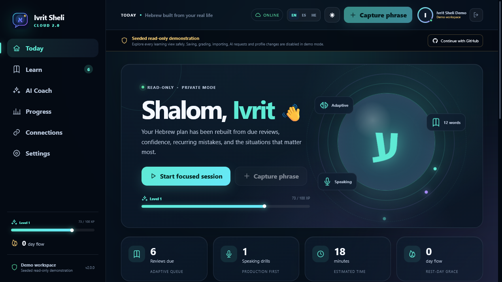
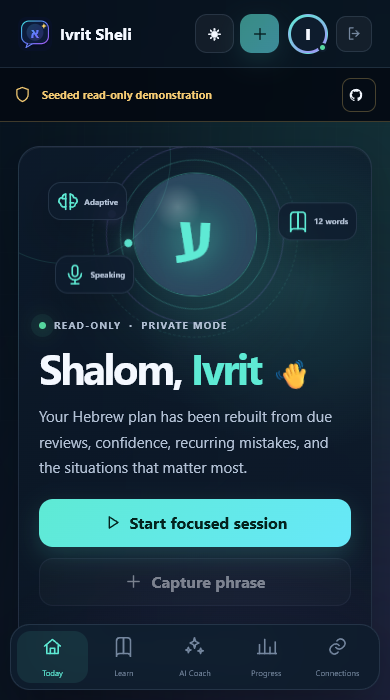
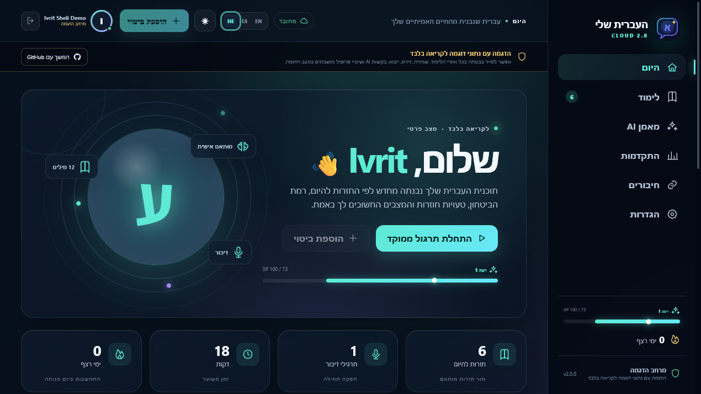
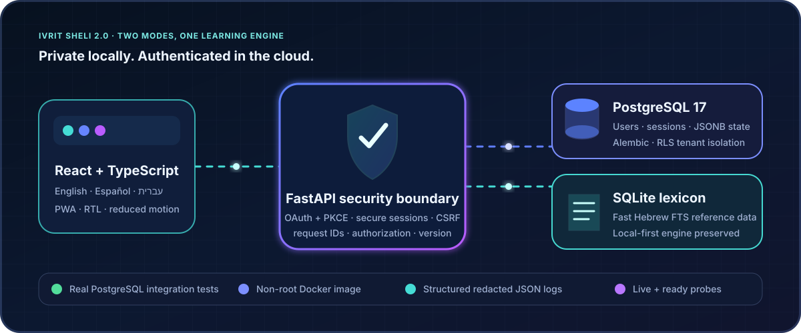
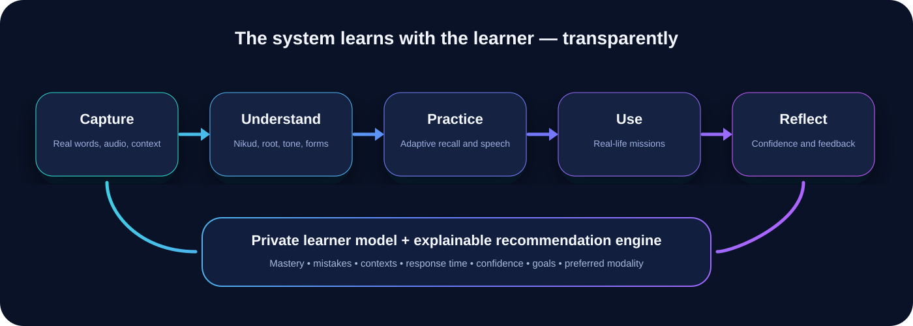

<div align="center">
  

  <h1>Ivrit Sheli 2.2.0 Ultimate — העברית שלי</h1>
  <p><strong>A private-first, authenticated, trilingual Hebrew-learning operating system built from real life.</strong></p>

  <p>
    <code>Hebrew • English • Spanish</code> ·
    <code>SQLite + PostgreSQL</code> ·
    <code>GitHub OAuth</code> ·
    <code>Docker</code> ·
    <code>AI-optional</code> ·
    <code>RTL-native</code> ·
    <code>Accessible motion</code>
  </p>

  <p>
    
    
    
    
  </p>
</div>

<p align="center">
  <a href="https://ivritsheli-production.up.railway.app"><strong>🌐 Open the verified live Ivrit Sheli 2.2.0 demo</strong></a>
</p>

### Live release truth

| Surface | Verified state |
|---|---|
| Source and live application | `2.2.0` |
| Railway production commit | `c8c928661bdcf179ed1d9df88b9f2e4d730ffea3` |
| Production storage/readiness | PostgreSQL · ready |
| Automated baseline | 139 unique backend tests + 48 frontend tests = 187 |
| GitHub publication | Git tag and GitHub Release `v2.2.0` are published and match the deployed source version |
| OAuth boundary | Consent handoff and cancellation are verified; final live authorization-code exchange, authenticated refresh persistence and logout are not verified end to end |
| Visual proof | The 2.2 social preview is current; README screenshots remain verified 2.1.x evidence and 2.2 interactive browser QA is pending |

The same conservative fields are available for portfolio/profile tooling in [`portfolio/project.json`](portfolio/project.json).

<picture>
  <source media="(max-width: 640px)" srcset="assets/readme/ivrit-sheli-2-mobile.png" />
  
</picture>

<details>
<summary><strong>📱 Open the verified mobile and Hebrew RTL views</strong></summary>

<table>
  <tr>
    <td width="34%" align="center"><strong>Responsive mobile workspace</strong></td>
    <td width="66%" align="center"><strong>Hebrew right-to-left workspace</strong></td>
  </tr>
  <tr>
    <td></td>
    <td></td>
  </tr>
</table>
</details>

> **Screenshot boundary:** these verified images show the deployed 2.1.x interface. The 2.2 social preview is current, while refreshed 2.2 desktop/mobile/RTL screenshots and interactive browser QA remain the next visual-proof task.

## Why this project exists 💙

Most language products make every learner follow the same path. Ivrit Sheli does the opposite: it converts the Hebrew you encounter at work, in Be'er Sheva, in messages, appointments, media, and daily conversations into an evolving personal curriculum.

The system tracks what you recognize, what you can produce, where you hesitate, which grammar errors repeat, which situations matter, and which learning mode works best. Recommendations are explainable: the app tells you *why* it selected a word, exercise, mission, or speaking drill.

## What changed in 2.2.0 🎙️

Version 2.2.0 turns pronunciation and vocabulary history into richer daily learning tools. Learners can keep a device-persisted masculine-style or feminine-style synthetic voice profile, record exactly one Hebrew word, and receive clearly sourced dictionary facts with English/Spanish meanings, grammar, forms, examples and optional consent-gated AI enrichment. Microphone permission is user-triggered, app-managed word-analysis uploads are temporary, and transcripts cannot award XP or change mastery.

The new saved-vocabulary registry makes every saved item searchable and filterable by status or review timing, with sorting, review counts, saved/activity dates and separate recognition, production, listening and speaking mastery. The dictionary now shows learning state, preserves homograph identity and atomically prevents new duplicate additions. Existing duplicate dictionary rows created before 2.2 are intentionally not auto-merged because their review histories need conservative reconciliation. A vector-only visual upgrade adds deeper surfaces, Hebrew letter constellations, refined navigation and restrained responsive motion while preserving RTL, high contrast and a fully stationary reduced-motion experience.

## What changed in 2.1.1 🔐

The 2.1.1 release was a focused safety, correctness, and accessibility update. Cloud AI and audio require stored learner consent before provider work begins; future reviews stay out of the due queue; dictionary readiness fails closed; SQLite upgrades run as atomic ordered migrations; and pronunciation history is recorded without letting an unverified client transcript change speaking mastery or XP.

The review experience also behaves correctly with keyboards, screen readers, and reduced-motion preferences. Quick capture and dictionary dialogs trap and restore focus, hidden answer controls cannot be reached early, and recorded audio preserves its real MIME type and transcription-provider context. This release was merged and deployed before 2.2.0 and remains historical production evidence.

## What changed in 2.1 🚆

Version 2.1 established the Railway production path at [ivritsheli-production.up.railway.app](https://ivritsheli-production.up.railway.app). The HTTPS application, liveness, PostgreSQL-backed readiness, immutable release identity, structured startup/health logs, and seeded read-only demo were verified in production. GitHub OAuth reaches GitHub's consent screen and cancellation returns safely to the app; the final authorization-code exchange and authenticated-session flow remain explicitly unclaimed until completed in a normal browser.

## What changed in 2.0 🚀

Version 2.0 turns the complete local-first learning system into a deployment-ready, production-shaped full-stack product without sacrificing its private offline path.



| Production capability | Verifiable implementation |
|---|---|
| Authentication | GitHub OAuth web flow with state, PKCE, short-lived single-use state and HMAC-hashed server-side sessions |
| Session security | Random bearers stored only as hashes; `HttpOnly`, `Secure`, `SameSite` cookies; logout revocation |
| Demo boundary | Deterministic non-admin tenant with seeded data and server-enforced read-only mutations |
| PostgreSQL | Users, sessions, OAuth state and one revisioned JSONB learner snapshot per authenticated user |
| Authorization | Request-derived identity, explicit tenant predicates and forced PostgreSQL row-level security under a restricted runtime role |
| Migrations | Alembic plus an idempotent provisioner; privileged migration and restricted runtime DSNs are separate |
| Containers | Multi-stage React/Python image, unprivileged runtime user, health check and persistent Compose volumes |
| Integration tests | Real PostgreSQL migration, persistence, session, cross-user isolation and RLS denial—not SQLite mocks |
| Observability | One redacted JSON log per completed request with correlation ID, status, duration, version and build commit |
| Operations | Independent liveness, readiness and immutable version endpoints plus explicit rollback/restore guidance |

The public-demo design does not contain Kevin's private learning history: it uses synthetic seeded phrases and cannot permanently mutate shared state. Paid AI and Kevin's Google provider credentials must remain disabled in any public recruiter deployment until its identity allowlists and cost controls are explicitly verified.

## What is included

| Area | Included implementation |
|---|---|
| Learning | Capture, adaptive reviews, speaking drills, sentence creation, missions, reflections |
| Personalization | Mastery model, mistake taxonomy, context frequency, confidence, latency, modality preference |
| AI | Offline deterministic coach plus OpenAI Responses adapter with structured outputs and fallback |
| Dictionary | Clickable Hebrew everywhere, bilingual senses, grammar/forms/examples/provenance, learned state, duplicate prevention |
| Word registry | Tenant-scoped search, status/due filters, sorting, review history, dates and four-skill mastery |
| Full lexicon | One-command importer for the current Kaikki/Wiktionary Hebrew JSONL dataset |
| Audio | Persistent synthetic voice styles, browser/OpenAI TTS, microphone one-word intelligence, consent-gated STT/AI, transparent scoring and ephemeral raw analysis audio |
| Gamification | XP ledger, levels, streaks, achievements, badges, mission bonuses, anti-grind limits |
| Integrations | Read-only Google Calendar, Gmail, and Drive adapters; ICS import; explicit consent gates |
| Languages | Trilingual interface and content layers: Hebrew, English, Spanish |
| UI | Responsive React app, RTL/LTR switching, custom SVG icons, motion, reduced-motion support |
| Reliability | FastAPI error handling, request IDs, liveness/readiness/version probes, real PostgreSQL integration tests, CI |
| Privacy | Local SQLite mode, isolated PostgreSQL tenants, read-only public demo, no analytics, explicit cloud consent |

## Product loop



1. **Capture** a phrase, screenshot transcription, audio clip, or context.
2. **Understand** niqqud, transliteration, grammar, root, register, and examples.
3. **Practice** recognition, recall, listening, speaking, cloze, and free production.
4. **Use** the phrase in a practical mission.
5. **Reflect** on confidence and outcome.
6. The private learner model updates recommendations without hiding the logic.

## Run locally

### Easiest Windows start 🟢

Double-click [`START_IVRIT_SHELI.bat`](START_IVRIT_SHELI.bat) in the project folder.

The launcher automatically:

- Installs dependencies when needed.
- Builds the latest interface.
- Creates and seeds the private local database on first launch.
- Keeps personal learning data in `%LOCALAPPDATA%\IvritSheli\data`, outside the OneDrive-synced source folder.
- Starts one private server bound to `127.0.0.1`.
- Opens Ivrit Sheli in your default browser.

Keep the launcher window open while using the app. Press `Ctrl+C` in that window to stop it safely; your progress remains stored locally. You can also launch it from PowerShell:

```powershell
.\scripts\start.ps1
```

The default address is `http://127.0.0.1:8000`. If that port is busy, the launcher selects the next available local port and opens the correct address automatically.

### Requirements

- Python 3.10+
- Node.js 20.19+; Node.js 22 LTS is recommended
- npm 10+
- SQLite with FTS5 support

PostgreSQL is required only for authenticated cloud mode. Docker Compose provides PostgreSQL 17 automatically.

### One-command setup on macOS/Linux

```bash
./scripts/setup.sh
./scripts/run-dev.sh
```

Then open `http://127.0.0.1:5173`.

### Windows development mode

```powershell
.\scripts\setup.ps1
.\scripts\run-dev.ps1
```

Development mode uses hot reload and opens at `http://127.0.0.1:5173`.

### Manual setup

```bash
# Backend
python -m venv .venv
source .venv/bin/activate
pip install -r backend/requirements.txt
PYTHONPATH=backend/src python -m ivrit_sheli --init --seed
uvicorn ivrit_sheli.api:app --app-dir backend/src --reload --port 8000

# Frontend, in a second terminal
cd frontend
npm ci
npm run dev
```

### Docker

```bash
docker compose config --quiet
docker compose up --build --wait
```

Then open `http://127.0.0.1:8000` and enter the seeded read-only demo. Compose builds the React frontend, runs Alembic and provisions the direct least-privilege `ivrit_sheli_runtime` login against PostgreSQL 17, starts the non-root FastAPI container and waits for `/health/ready`.

```bash
curl http://127.0.0.1:8000/health/live
curl http://127.0.0.1:8000/health/ready
curl http://127.0.0.1:8000/version
```

The checked-in Compose secrets and separate administrator/runtime database passwords are local-development values only. Production variables and Railway deployment are documented in [`docs/DEPLOYMENT.md`](docs/DEPLOYMENT.md).

## Authentication and ownership 🔐

Local-first mode remains writable without an online account. Cloud mode requires an authenticated session and never accepts a client-supplied owner ID.

- **GitHub sign-in:** identity-only `read:user` OAuth, state + PKCE, no repository permission.
- **Private sessions:** session and CSRF tokens are random; only their hashes are durable.
- **Bounded public surface:** layered client/global auth limits, per-user write and session caps, and a 4 MiB cloud-snapshot ceiling limit abuse and storage growth.
- **Tenant storage:** one PostgreSQL learner state per user with explicit ownership and forced RLS.
- **Read-only demo:** synthetic seeded data, no admin rights and `403` on private mutations.
- **Logout:** server-side revocation, not merely browser cookie removal.
- **Cloud continuity:** the private SQLite launcher remains available when a hosting service is offline.

## Full Hebrew dictionary

The package contains a small attributed demo lexicon so the app works immediately. To install the full machine-readable Hebrew dictionary:

```bash
source .venv/bin/activate
PYTHONPATH=backend/src python -m ivrit_sheli \
  --download-dictionary \
  --dictionary-url "https://kaikki.org/dictionary/Hebrew/kaikki.org-dictionary-Hebrew.jsonl"
```

Or import an existing file:

```bash
PYTHONPATH=backend/src python -m ivrit_sheli \
  --dictionary-jsonl data/imports/kaikki.org-dictionary-Hebrew.jsonl
```

The importer streams JSONL instead of loading it into memory. Entries retain provenance and license metadata. Every Hebrew token can open the dictionary; inflected forms and roots are cross-linked and clickable. Dictionary-derived content must keep its Wiktionary/Kaikki attribution and share-alike notices; see [`THIRD_PARTY_NOTICES.md`](THIRD_PARTY_NOTICES.md).

## AI configuration

The app is fully usable with `AI_PROVIDER=offline`. Online AI is optional and never receives content without an explicit user action.

```bash
cp .env.example .env
# Add OPENAI_API_KEY locally; never commit it.
```

Implemented AI functions:

- Sentence correction with mistake categories.
- Naturalness and register analysis.
- Niqqud and transliteration assistance.
- Grammar, root, and word-family explanation.
- Personalized exercise generation.
- Contextual dialogue and role-play.
- Weekly learning-plan generation.
- Real-life mission generation.
- Conversation summarization into learning items.
- Semantic recommendation support through embeddings.
- Feedback-aware prompt context from the private learner model.

The OpenAI adapter uses the Responses API with strict structured JSON output. The configured default is `gpt-5.6-luna`, and it remains editable in `.env`. When a provider is unavailable, every endpoint returns a working offline result with `degraded_mode: true` instead of crashing.

## Audio system

The application supports three layers:

1. **Browser speech synthesis** for zero-key pronunciation playback.
2. **OpenAI text-to-speech** for generated voice files when configured.
3. **OpenAI speech-to-text** or browser speech recognition for speaking attempts.

Choose a persistent masculine-style or feminine-style synthetic profile. Browser playback selects a deterministic installed Hebrew voice plus a pitch fallback; cloud playback maps the style to server-controlled provider voice IDs. These labels describe a synthetic presentation preference, not the identity or gender of a real speaker.

The microphone word-intelligence card accepts one Hebrew word from browser recognition, optional cloud transcription, or manual entry. It returns source-labeled dictionary meanings, translations, grammar, forms and examples, with optional consent-gated AI enrichment. Ivrit Sheli does not receive or retain browser-recognition audio, although the browser or operating-system speech provider's policy may apply. App-managed cloud uploads are deleted after processing; the configured provider's policy remains separate. This analysis cannot award XP or update mastery.

Pronunciation scoring is deliberately transparent. It compares normalized transcription, word coverage, sequence similarity, and omitted/extra words. It does **not** claim phoneme-level clinical accuracy.

## Personalization connectors

All connectors are disabled by default and read-only:

- **Calendar:** upcoming contexts can produce relevant phrase packs, such as medical, work, travel, or bureaucracy vocabulary.
- **Gmail:** only explicitly selected message snippets are converted into learning material.
- **Drive:** only explicitly selected documents are processed.
- **ICS:** local calendar files can be imported without a cloud connection.

The app stores connector state and consent inside the active learner boundary: local SQLite in private mode or that authenticated user's PostgreSQL tenant snapshot in cloud mode. See [`docs/CONNECTORS.md`](docs/CONNECTORS.md).

## XP and achievements

XP rewards language outcomes, not screen tapping.

| Action | Base XP |
|---|---:|
| Correct review | 10 |
| Difficult item mastered | 18 |
| Speaking attempt completed | 20 |
| Real-life mission completed | 50 |
| Reflection recorded | 12 |
| New phrase used successfully | 65 |
| Weekly plan completed | 100 |

Daily anti-grind limits reduce exploitative repetition. Streaks use grace rules and never punish Shabbat or a configured weekly rest period.

Implemented achievements:

- First Word — save the first learning item.
- Seven-Day Flow — sustain a seven-day meaningful-practice streak.
- Voice Builder — complete 25 speaking attempts.
- Word Explorer — save 100 distinct active dictionary words.
- Israel in Action — complete 10 real-life missions successfully.
- Three-Language Mind — use all three interface languages.

## Test everything

The 2.2.0 verification baseline is **139 unique backend tests + 48 frontend tests = 187 passing automated tests**. The ordinary backend run reports 138 passed with one credential-gated PostgreSQL case skipped; the dedicated PostgreSQL 17 gate runs all three database-boundary tests and supplies that one additional unique pass. The integration gate is not replaced by SQLite or an in-memory fake.

```bash
./scripts/test-all.sh
```

Or separately:

```bash
PYTHONPATH=backend/src pytest backend/tests -q
cd frontend && npm test -- --run
cd frontend && npm run build
docker compose up --build --wait
```

External APIs are tested through deterministic HTTP fakes. Live credentials are never required for CI. Use the explicit opt-in smoke test after adding credentials:

```bash
PYTHONPATH=backend/src python -m ivrit_sheli --doctor --live
```

See [`TEST_REPORT.md`](TEST_REPORT.md) for the commands and results produced for this package.

## Repository map

```text
IvritSheli/
├── .github/                    # CI and dependency-update automation
├── assets/                     # Brand, README art, achievement badges
├── backend/
│   ├── src/ivrit_sheli/        # API, engines, repositories, connectors, CLI
│   ├── migrations/             # Versioned PostgreSQL Alembic schema
│   └── tests/                  # Unit and integration tests
├── frontend/
│   ├── public/                 # PWA manifest and app icon
│   └── src/                    # React + TypeScript UI
├── data/                       # Local databases, imports, audio, backups
├── docs/                       # Detailed product and engineering guides
├── scripts/                    # Setup, run, test, and verification scripts
├── Dockerfile
├── docker-compose.yml
├── railway.toml                # Deployment, migration and health policy
├── Makefile
└── README.md
```

## Documentation

- [`docs/ULTIMATE_BUILD_SPEC.md`](docs/ULTIMATE_BUILD_SPEC.md) — complete product instructions and acceptance criteria.
- [`docs/ARCHITECTURE.md`](docs/ARCHITECTURE.md) — boundaries, data flow, schema, and failure modes.
- [`docs/AI_ENGINE.md`](docs/AI_ENGINE.md) — provider design, schemas, fallback, and learner feedback loop.
- [`docs/DICTIONARY.md`](docs/DICTIONARY.md) — import pipeline, clickable Hebrew, provenance, and licensing.
- [`docs/AUDIO.md`](docs/AUDIO.md) — recording, TTS, STT, scoring, and privacy.
- [`docs/GAMIFICATION.md`](docs/GAMIFICATION.md) — XP economy, achievements, streaks, and anti-abuse rules.
- [`docs/PERSONALIZATION.md`](docs/PERSONALIZATION.md) — learner model and explainable recommendations.
- [`docs/DESIGN_SYSTEM.md`](docs/DESIGN_SYSTEM.md) — colors, icons, animation, RTL, and accessibility.
- [`docs/CONNECTORS.md`](docs/CONNECTORS.md) — Google/ICS setup and consent rules.
- [`docs/API.md`](docs/API.md) — endpoint catalog.
- [`docs/DEPLOYMENT.md`](docs/DEPLOYMENT.md) — local, Docker, and production hardening.
- [`docs/USER_GUIDE.md`](docs/USER_GUIDE.md) — complete learner and administrator workflow.
- [`docs/DEMO_DAY.md`](docs/DEMO_DAY.md) — two-minute video and live presentation plan.
- [`PACKAGE_MANIFEST.md`](PACKAGE_MANIFEST.md) — exact release contents and credential boundaries.
- [`TEST_REPORT.md`](TEST_REPORT.md) — commands, results, and honest limitations.
- [`SECURITY.md`](SECURITY.md) — session, tenant, logging, secret-management, reporting, and incident controls.

## Privacy promise 🔒

- No account required for private local-first mode.
- Cloud identities are limited to GitHub ID, login, display name and avatar; GitHub OAuth tokens are never persisted, while optional Google credentials stay only in server-side configuration and never enter learner data.
- Public demo content is synthetic, tenant-isolated and read-only.
- No advertising or behavioral analytics.
- No secret keys in frontend code.
- No cloud synchronization by default.
- No automatic email/document ingestion.
- Learner data can be exported as JSON; self-service cloud-account deletion is a documented post-2.0 privacy improvement and is not claimed as implemented.
- External requests are labeled before content leaves the device.

## Project status

Version 2.2.0 is implemented, merged, tagged, published as a GitHub Release and live at [ivritsheli-production.up.railway.app](https://ivritsheli-production.up.railway.app) from production commit `c8c928661bdcf179ed1d9df88b9f2e4d730ffea3`. Selectable voice styles, microphone word intelligence, the saved-vocabulary registry, the expanded dictionary and the visual/motion system pass the local automated, real-PostgreSQL and production-image gates documented in [`TEST_REPORT.md`](TEST_REPORT.md); the live service reports release `2.2.0`, environment `production`, PostgreSQL storage and ready health checks. Successful final GitHub code exchange, authenticated persistence across refreshes, logout, live OpenAI/Google calls, two-identity production isolation, refreshed 2.2 screenshots, 2.2 interactive browser visual QA and backup restoration remain honest operator checks rather than inflated claims.

Passing tests and healthy local production-image checks materially reduce risk but do not prove that software is defect-free. Operational limits, credential-dependent checks and restore requirements are documented explicitly rather than hidden behind a perfect-score claim.

## License

Application source code and Ivrit Sheli UI graphics: MIT. Dictionary-derived data uses separate Wiktionary/Kaikki terms. The personal `KC ✦ LT` identity mark is reserved and excluded from the MIT asset grant. See [`LICENSE`](LICENSE) and [`THIRD_PARTY_NOTICES.md`](THIRD_PARTY_NOTICES.md).

<div align="center">
  
  <p><sub>Designed, engineered and signed by Kevin Cusnir · Lirioth Teltanion 💙</sub></p>
</div>
