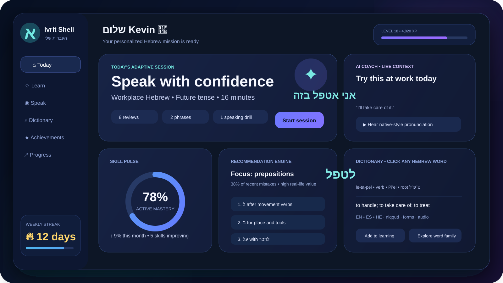

<div align="center">
  

  <h1>Ivrit Sheli Ultimate — העברית שלי</h1>
  <p><strong>A private, adaptive, trilingual Hebrew-learning operating system built from real life.</strong></p>

  <p>
    <code>Hebrew • English • Spanish</code> ·
    <code>Local-first</code> ·
    <code>AI-optional</code> ·
    <code>RTL-native</code> ·
    <code>Accessible motion</code>
  </p>

  <p>
    
    
    
    
  </p>
</div>



## Why this project exists 💙

Most language products make every learner follow the same path. Ivrit Sheli does the opposite: it converts the Hebrew you encounter at work, in Be'er Sheva, in messages, appointments, media, and daily conversations into an evolving personal curriculum.

The system tracks what you recognize, what you can produce, where you hesitate, which grammar errors repeat, which situations matter, and which learning mode works best. Recommendations are explainable: the app tells you *why* it selected a word, exercise, mission, or speaking drill.

## What is included

| Area | Included implementation |
|---|---|
| Learning | Capture, adaptive reviews, speaking drills, sentence creation, missions, reflections |
| Personalization | Mastery model, mistake taxonomy, context frequency, confidence, latency, modality preference |
| AI | Offline deterministic coach plus OpenAI Responses adapter with structured outputs and fallback |
| Dictionary | Clickable Hebrew everywhere, SQLite search, niqqud-insensitive lookup, forms, roots, senses, audio URLs |
| Full lexicon | One-command importer for the current Kaikki/Wiktionary Hebrew JSONL dataset |
| Audio | Browser TTS, microphone recording, OpenAI TTS/STT adapters, transcription-based pronunciation scoring |
| Gamification | XP ledger, levels, streaks, achievements, badges, mission bonuses, anti-grind limits |
| Integrations | Read-only Google Calendar, Gmail, and Drive adapters; ICS import; explicit consent gates |
| Languages | Trilingual interface and content layers: Hebrew, English, Spanish |
| UI | Responsive React app, RTL/LTR switching, custom SVG icons, motion, reduced-motion support |
| Reliability | FastAPI error handling, request IDs, local bug reports, health checks, unit/API/UI tests, CI |
| Privacy | Local SQLite, no analytics by default, no cloud account required, export/delete controls |

## Product loop


1. **Capture** a phrase, screenshot transcription, audio clip, or context.
2. **Understand** niqqud, transliteration, grammar, root, register, and examples.
3. **Practice** recognition, recall, listening, speaking, cloze, and free production.
4. **Use** the phrase in a practical mission.
5. **Reflect** on confidence and outcome.
6. The private learner model updates recommendations without hiding the logic.

## Run locally

### Requirements

- Python 3.10+
- Node.js 20+
- npm 10+
- SQLite with FTS5 support

### One-command setup on macOS/Linux

```bash
./scripts/setup.sh
./scripts/run-dev.sh
```

Then open `http://127.0.0.1:5173`.

### One-command setup on Windows PowerShell

```powershell
.\scripts\setup.ps1
.\scripts\run-dev.ps1
```

Then open `http://127.0.0.1:5173`.

### Manual setup

```bash
# Backend
python -m venv .venv
source .venv/bin/activate
pip install -r backend/requirements.txt
PYTHONPATH=backend/src python -m ivrit_sheli --init --seed
uvicorn ivrit_sheli.api:app --app-dir backend/src --reload --port 8000

# Frontend, in a second terminal
cd frontend
npm ci
npm run dev
```

### Docker

```bash
docker compose up --build
```

The production container builds the React frontend, seeds a fresh private volume, and serves the installable PWA through FastAPI.

## Full Hebrew dictionary

The package contains a small attributed demo lexicon so the app works immediately. To install the full machine-readable Hebrew dictionary:

```bash
source .venv/bin/activate
PYTHONPATH=backend/src python -m ivrit_sheli \
  --download-dictionary \
  --dictionary-url "https://kaikki.org/dictionary/Hebrew/kaikki.org-dictionary-Hebrew.jsonl"
```

Or import an existing file:

```bash
PYTHONPATH=backend/src python -m ivrit_sheli \
  --dictionary-jsonl data/imports/kaikki.org-dictionary-Hebrew.jsonl
```

The importer streams JSONL instead of loading it into memory. Entries retain provenance and license metadata. Every Hebrew token can open the dictionary; inflected forms and roots are cross-linked and clickable. Dictionary-derived content must keep its Wiktionary/Kaikki attribution and share-alike notices; see [`THIRD_PARTY_NOTICES.md`](THIRD_PARTY_NOTICES.md).

## AI configuration

The app is fully usable with `AI_PROVIDER=offline`. Online AI is optional and never receives content without an explicit user action.

```bash
cp .env.example .env
# Add OPENAI_API_KEY locally; never commit it.
```

Implemented AI functions:

- Sentence correction with mistake categories.
- Naturalness and register analysis.
- Niqqud and transliteration assistance.
- Grammar, root, and word-family explanation.
- Personalized exercise generation.
- Contextual dialogue and role-play.
- Weekly learning-plan generation.
- Real-life mission generation.
- Conversation summarization into learning items.
- Semantic recommendation support through embeddings.
- Feedback-aware prompt context from the private learner model.

The OpenAI adapter uses the Responses API with strict structured JSON output. The configured default is `gpt-5.6-luna`, and it remains editable in `.env`. When a provider is unavailable, every endpoint returns a working offline result with `degraded_mode: true` instead of crashing.

## Audio system

The application supports three layers:

1. **Browser speech synthesis** for zero-key pronunciation playback.
2. **OpenAI text-to-speech** for generated voice files when configured.
3. **OpenAI speech-to-text** or browser speech recognition for speaking attempts.

Pronunciation scoring is deliberately transparent. It compares normalized transcription, word coverage, sequence similarity, and omitted/extra words. It does **not** claim phoneme-level clinical accuracy.

## Personalization connectors

All connectors are disabled by default and read-only:

- **Calendar:** upcoming contexts can produce relevant phrase packs, such as medical, work, travel, or bureaucracy vocabulary.
- **Gmail:** only explicitly selected message snippets are converted into learning material.
- **Drive:** only explicitly selected documents are processed.
- **ICS:** local calendar files can be imported without a cloud connection.

The app stores connector state and consent locally. See [`docs/CONNECTORS.md`](docs/CONNECTORS.md).

## XP and achievements

XP rewards language outcomes, not screen tapping.

| Action | Base XP |
|---|---:|
| Correct review | 10 |
| Difficult item mastered | 18 |
| Speaking attempt completed | 20 |
| Real-life mission completed | 50 |
| Reflection recorded | 12 |
| New phrase used successfully | 65 |
| Weekly plan completed | 100 |

Daily anti-grind limits reduce exploitative repetition. Streaks use grace rules and never punish Shabbat or a configured weekly rest period.

Included achievement families:

- First word and first spoken phrase.
- Review streaks and comeback milestones.
- Dictionary exploration.
- Root-family discovery.
- Real-life usage.
- Workplace Hebrew.
- Pronunciation consistency.
- Trilingual interface use.
- Error-pattern improvement.

## Test everything

The packaged verification baseline is **60 backend tests + 6 frontend tests = 66 passing tests**.

```bash
./scripts/test-all.sh
```

Or separately:

```bash
PYTHONPATH=backend/src pytest backend/tests -q
cd frontend && npm test -- --run
cd frontend && npm run build
```

External APIs are tested through deterministic HTTP fakes. Live credentials are never required for CI. Use the explicit opt-in smoke test after adding credentials:

```bash
PYTHONPATH=backend/src python -m ivrit_sheli --doctor --live
```

See [`TEST_REPORT.md`](TEST_REPORT.md) for the commands and results produced for this package.

## Repository map

```text
ivrit-sheli-ultimate/
├── assets/                     # Brand, README art, achievement badges
├── backend/
│   ├── src/ivrit_sheli/        # API, engines, repositories, connectors, CLI
│   └── tests/                  # Unit and integration tests
├── frontend/
│   ├── public/                 # PWA manifest and app icon
│   └── src/                    # React + TypeScript UI
├── data/                       # Local databases, imports, audio, backups
├── docs/                       # Detailed product and engineering guides
├── scripts/                    # Setup, run, test, and verification scripts
├── Dockerfile
├── docker-compose.yml
├── Makefile
└── README.md
```

## Documentation

- [`docs/ULTIMATE_BUILD_SPEC.md`](docs/ULTIMATE_BUILD_SPEC.md) — complete product instructions and acceptance criteria.
- [`docs/ARCHITECTURE.md`](docs/ARCHITECTURE.md) — boundaries, data flow, schema, and failure modes.
- [`docs/AI_ENGINE.md`](docs/AI_ENGINE.md) — provider design, schemas, fallback, and learner feedback loop.
- [`docs/DICTIONARY.md`](docs/DICTIONARY.md) — import pipeline, clickable Hebrew, provenance, and licensing.
- [`docs/AUDIO.md`](docs/AUDIO.md) — recording, TTS, STT, scoring, and privacy.
- [`docs/GAMIFICATION.md`](docs/GAMIFICATION.md) — XP economy, achievements, streaks, and anti-abuse rules.
- [`docs/PERSONALIZATION.md`](docs/PERSONALIZATION.md) — learner model and explainable recommendations.
- [`docs/DESIGN_SYSTEM.md`](docs/DESIGN_SYSTEM.md) — colors, icons, animation, RTL, and accessibility.
- [`docs/CONNECTORS.md`](docs/CONNECTORS.md) — Google/ICS setup and consent rules.
- [`docs/API.md`](docs/API.md) — endpoint catalog.
- [`docs/DEPLOYMENT.md`](docs/DEPLOYMENT.md) — local, Docker, and production hardening.
- [`docs/USER_GUIDE.md`](docs/USER_GUIDE.md) — complete learner and administrator workflow.
- [`docs/DEMO_DAY.md`](docs/DEMO_DAY.md) — two-minute video and live presentation plan.
- [`PACKAGE_MANIFEST.md`](PACKAGE_MANIFEST.md) — exact release contents and credential boundaries.
- [`TEST_REPORT.md`](TEST_REPORT.md) — commands, results, and honest limitations.

## Privacy promise 🔒

- No account required.
- No advertising or behavioral analytics.
- No secret keys in frontend code.
- No cloud synchronization by default.
- No automatic email/document ingestion.
- Export and deletion are always available.
- External requests are labeled before content leaves the device.

## Project status

This package is a production-shaped reference implementation: its offline path, domain engines, API, UI build, and mocked provider adapters are testable. Live OpenAI and Google calls require the user's own credentials and consent, so they are not silently exercised during packaging.

## License

Application source code: MIT. Dictionary-derived data: separate Wiktionary/Kaikki terms apply. See [`LICENSE`](LICENSE) and [`THIRD_PARTY_NOTICES.md`](THIRD_PARTY_NOTICES.md).
