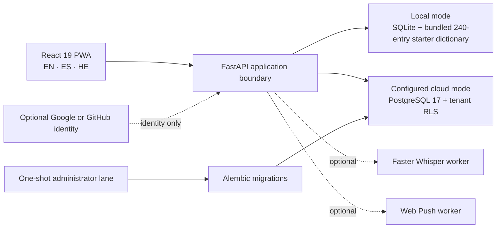

<div align="center">
  

  <h1>Ivrit Sheli 2.12.3 — El hebreo vivo de cada día</h1>
  <p><strong>A trilingual, local-first PWA for learning the Hebrew people meet in everyday life.</strong></p>
  <p>Guided enough for a complete beginner, deep enough to keep growing.</p>

  <p>
    <a href="https://ivrit-sheli-staging.onrender.com"></a>
    
    
    
    
  </p>
  <p>
    
    
  </p>
</div>

<br />

> **The Living Hebrew Journey** — explore a beautifully crafted, evidence-based learning environment that adapts to your language, your pacing, and your daily life in Israel. Privacy is built-in; your progress stays local by default until you decide to back it up.

## 🏛️ Learning Hubs & Experience Depth

<p align="center">
  
</p>

The platform is organized into living, stable learning hubs. Their visible names prioritize clear actions, while internal routes provide semantic stability:

- **Today (היום)** — Your daily starting point. Actionable phrases, retention algorithms, and daily flow.
- **Alphabet Studio** — Foundation building. 22 base letters, 5 final forms, and vowel maps.
- **Dictionary (מילון)** — Your semantic anchor. Root-based connections, exact trilingual translations, and audio.
- **AI Coach (Beta)** — Real-time conversation simulation and grammatical feedback driven by offline-capable models.
- **Settings** — Deep personalization. Switch between 14 aesthetic themes, toggle RTL interfaces, and manage your local data vault.

Three persistent depths change how information is presented without hiding rooms or confusing the learner:

- **Guided** — uses simpler language, removes complex grammatical terms, and keeps context visible.
- **Explorer** — the balanced default: a calm, self-directed visit.
- **Deep Dive** — exposes linguistic roots, transliteration details, exact stats, and advanced controls.

## 🌍 Language, Themes and Accessibility

<p align="center">
  
</p>

- **Trilingual Core:** English, Spanish, and Hebrew interfaces working seamlessly together.
- **RTL Architecture:** Genuine Right-to-Left document direction and `he-IL` formatting that respects the language.
- **Expressive Aesthetics:** 14 distinct dark and light themes. 
- **Accessibility First:** Keyboard-aware navigation, focus restoration, and mobile drawer behavior.
- **Motion Polish:** Reduced-motion support across application transitions, elegant charts, and static repository artwork.

---

## 📡 Live Staging & Deployment

This is the **verified 2.12.3 release**. The application is now publicly deployed and verified on Render with Supabase.

| Component | Status | Details |
|---|---|---|
| **Web Service** | 🟢 Live | [ivrit-sheli-staging.onrender.com](https://ivrit-sheli-staging.onrender.com) (Render Free) |
| **Database** | 🟢 Live | Supabase PostgreSQL 17 via IPv4 Session Pooler (`port 6543`) |
| **Authentication** | 🟢 Live | Google OAuth 2.0 with strict origin validation |
| **Source Release** | `v2.12.3` | Exact immutable source checkpoint |

## 📸 2.12.3 Visual Proof

<p align="center">
  
</p>
<p align="center">
  
</p>
<p align="center"><em>An eight-second, non-looping tour built from four privacy-reviewed 2.12.3 candidate captures.</em></p>

<table>
  <tr>
    <td width="40%" align="center"><strong>Responsive mobile flow</strong></td>
    <td width="60%" align="center"><strong>Real Hebrew RTL layout</strong></td>
  </tr>
  <tr>
    <td></td>
    <td></td>
  </tr>
</table>

<table>
  <tr>
    <td width="50%" align="center"><strong>Alphabet Studio</strong></td>
    <td width="50%" align="center"><strong>Linked dictionary</strong></td>
  </tr>
  <tr>
    <td></td>
    <td></td>
  </tr>
</table>

These five WebP assets were captured on 2026-08-27 Asia/Jerusalem from a fresh,
generic local learner with no personal progress. Every image was reviewed at
full size, at GitHub display scale and in grayscale. The GIF was rendered twice
to byte-identical output, checked at four representative frames, and contains
no loop extension. Hashes, physical dimensions, source PNG hashes, locale,
direction, viewport, timestamps, privacy findings, process provenance and the
dirty-tree boundary are recorded in the
[`2.12.3 candidate visual-proof manifest`](assets/readme/proof/2.12.3/manifest.json).
The immutable
[`2.12.2 published visual record`](assets/readme/proof/2.12.2/manifest.json)
remains preserved separately; the older 17-PNG candidate set is not presented
as current proof.

## What the product teaches

Ivrit Sheli turns practical Hebrew—greetings, transport, food, health, work,
messages, appointments, and daily routines—into one explainable learning loop:

```text
notice → understand → practise → use → reflect → choose the next useful step
```

- **Three learner experiences.** Guided keeps the next action obvious; Explorer
  opens more context and choice; Experienced exposes depth without forcing it
  on a beginner.
- **240 reviewed concepts, 240 exact scenes.** Each starter meaning maps to a
  deterministic local SVG scene rather than a generic category icon. The
  progressive `context → meaning → anchor` layers support recognition while
  remaining offline and theme-aware.
- **An honest Hebrew alphabet model.** The studio teaches 22 base letters plus
  the 5 positional final forms—27 written forms, not 27 different letters—with
  pointed names, pronunciation notes, examples, and linked practice.
- **Deterministic personalization.** A local learning engine combines review
  history, learner feedback, mistakes, relevance, and bounded rules. The coach
  explains why it selected an activity instead of presenting opaque AI output
  as fact.
- **Progress with inspectable rules.** XP, streaks, mastery signals, and 19
  declarative achievements reward meaningful learning behavior.
- **Optional speech and reminders.** Self-hosted Faster Whisper and Web Push
  exist as separately configured capabilities; neither is required by the
  standard local or Docker experience.

The curriculum is structured for A0–A2. A B1/B2 area is explicitly experimental
and must not be read as complete advanced-level coverage.

## Languages, RTL, and accessibility

| Concern | Implemented boundary | Fresh evidence |
|---|---|---|
| English and Spanish | LTR interface and reviewed locale catalogs | The 2.12.3 proof includes Spanish desktop/mobile; the current browser matrix exercised both EN and ES |
| Hebrew | `lang="he"`, mirrored navigation, RTL content and controls | The 2.12.3 proof includes a Hebrew/RTL desktop capture; the current browser matrix also exercised HE at all three viewports |
| Responsive layout | Desktop and mobile navigation, reflow, touch targets | Mobile capture; Chromium measured `clientWidth = scrollWidth = 390` |
| Keyboard and semantics | Semantic controls, visible focus, labels, live regions | Covered in component tests and the formal three-viewport Playwright matrix |
| Reduced motion | Motion tokens and stationary alternatives | Exact served runtime computed the ambient animation as `none` under `prefers-reduced-motion` |
| Automated accessibility | Axe integration in Playwright | Exact served HE/RTL mobile check reported 0 total WCAG 2 A/AA and 2.1 A/AA violations |

The current 2.12.3 browser gate used a fresh exact FastAPI-served bundle with
CSP and deterministic API fixtures. Its formal three-viewport Playwright matrix
passed 36 tests with 40 intentional project-scoped skips and zero failures
among 76 listed cases in 4.5 minutes, including
the 240-scene compare gallery, EN/ES/HE, RTL, reduced motion, 200% text reflow,
responsive journey art and axe coverage. It proves those browser behaviors; it
does **not** prove PostgreSQL, OAuth providers, or hosted persistence. Generated
contact-sheet inspection and real human recognition remain separate gates.

## Architecture



The ordinary application connects to PostgreSQL as the restricted
`ivrit_sheli_runtime` role. It cannot create objects, bypass row-level security,
or switch roles. `MIGRATION_DATABASE_URL` belongs only to the one-shot Alembic
provisioning lane and must never reach the web process. See
[`docs/SUPABASE_RUNTIME_ROLE.md`](docs/SUPABASE_RUNTIME_ROLE.md).

### Data and identity modes

| Mode | Account | Storage | Intended use |
|---|---|---|---|
| Local | None | SQLite on the learner's device | Private learning and development |
| Demo | Synthetic read-only session | Server-provided demonstration state | Product exploration without implying persistence |
| Authenticated cloud | Optional Google `openid profile` or GitHub `read:user` | Tenant-scoped PostgreSQL snapshot | Cross-device continuity when a host and providers are deliberately configured |

A static source scan found no integrated analytics or behavioral-tracker SDK.
That is a code finding—not a promise of zero network traffic in every future
environment. OAuth, read-only connectors, cloud AI, speech, and push are
optional external boundaries and remain disabled until explicitly configured.
Read [`PRIVACY.md`](PRIVACY.md) and [`SECURITY.md`](SECURITY.md) before enabling
them.

## Run locally

### Windows: one private served app

Requirements: Python 3.10+, Node.js 20.19+ and npm 10+. Node.js 22 LTS is the
documented recommendation.

```powershell
.\START_IVRIT_SHELI.bat
```

On first run the launcher prepares dependencies, builds the frontend, seeds the
starter data, and opens a localhost port. By default, learner data is stored
outside the repository under `%LOCALAPPDATA%\IvritSheli\data`. The production
build is served through FastAPI, so the real Content Security Policy and route
fallbacks are active.

Equivalent PowerShell entry points:

```powershell
pwsh -File scripts/setup.ps1
pwsh -File scripts/start.ps1 -Language es
```

### Development with hot reload

```powershell
pwsh -File scripts/run-dev.ps1
```

Vite runs on port 5173 for development and FastAPI on port 8000. Before calling
a UI slice complete, build it and inspect the FastAPI-served path on port 8000;
Vite does not apply the application's production Content Security Policy.

### Docker

```powershell
docker compose up --build --wait
```

Open `http://127.0.0.1:8000`, then stop the stack without deleting volumes:

```powershell
docker compose down
```

The Compose file contains local-development credentials only. It is not a
deployable production configuration, and migration credentials are stripped
before Uvicorn starts.

## Tests and reproducible evidence

The repository's primary local gate is:

```powershell
cd frontend
npx tsc -b --pretty false
npx vitest run
npm run build
npm run test:capture

cd ..
.\.venv\Scripts\python.exe -m pytest backend\tests -q -p no:cacheprovider
.\.venv\Scripts\python.exe -m ruff check backend\src backend\tests scripts
.\.venv\Scripts\python.exe -m mypy backend\src
git diff --check
```

The README capture tool is explicit and fail-closed:

```powershell
cd frontend
npm run capture:readme -- --app-origin http://127.0.0.1:8000 --auth-mode local
```

It requires an origin and authentication mode, isolates every run, rejects HTTP
errors and stale/wrong states, checks title/route/locale/direction/theme/layout,
records console and network failures, and writes a manifest even when capture
fails. Public assets are never promoted automatically. Four focused capture
contract tests cover PNG dimensions/hash evidence, scoped navigation, missing
origin failure, and HTTP 404 failure.

Fresh local results for the private `2.12.3` candidate on 2026-08-27:

| Gate | Result |
|---|---|
| Frontend Vitest | **859 passed / 49 files / 0 failed** |
| Backend pytest | **387 passed / 1 PostgreSQL credential-gated skip / 0 failed** |
| Capture contracts | **4 passed / 0 failed** with Node's test runner |
| TypeScript + production build | **Passed**; Vite 8.1.4 transformed 134 modules in 1.75 s; the existing `advancedChunks` deprecation warning remains |
| Ruff + strict MyPy | **Passed**; MyPy checked 39 source files |
| Offline doctor | **7/7 passed** as 2.12.3; 244 dictionary rows include the declared 240-entry starter set |
| Dependency audits | **0 known vulnerabilities** in the production npm dependency scope and Python requirements |
| Formal Playwright matrix on fresh FastAPI port 8200 | **36 passed / 40 intentional project-scoped skips / 0 failed** across 76 listed cases in 4.5 minutes; phone, tablet, desktop, EN/ES/HE, RTL, zoom, reduced motion, all 240 scenes and axe were exercised |
| README visual-proof contract | **Passed** for five WebP files plus the non-looping GIF, including exact hashes, dimensions, links and privacy-reviewed provenance |
| Current Docker gate | **Passed**: the 2.12.3 image built, became ready with SQLite, reported the expected version, ran PID 1 as UID/GID 10001 and contained no `MIGRATION_DATABASE_URL`; the exact smoke container was removed and port 8300 left clean |
| Current PostgreSQL gate | **Not rerun for 2.12.3**; the one integration test remained credential-gated and the 2.12.2 PostgreSQL evidence stays historical |
| Package integrity | **Passed** for the explicitly staged candidate snapshot: 571 canonical Git-index checksums, 230 required files and all packaged assets verified |

The checksum manifest was regenerated only after the intended snapshot was
explicitly staged. The 17 older PNG candidates and local Playwright inspection
YAML remain preserved outside the package. The canonical release ZIP is built
from the immutable tagged Git tree, with its SHA-256 stored beside the external
asset rather than inside the self-referential source package. The successful
suites retain non-fatal test-environment warnings documented in
[`TEST_REPORT.md`](TEST_REPORT.md). Results must be rerun after a subsequent
code edit; historical ledger counts must never be relabelled as current.

## Performance evidence

A bounded 2026-08-26 investigation reproduced the reported slow external demo
bootstrap and separated it from frontend delivery:

| Measurement | Three-run median | Boundary |
|---|---:|---|
| Exact current local FastAPI + SQLite, cold stable workspace | **2.07 s** | Commit baseline plus dirty tree, loopback |
| Temporary external landing page | **1.21 s** | Older Docker image through an ephemeral diagnostic tunnel |
| Temporary external demo, fully stable | **44.97 s** | Remote PostgreSQL path; not exact-current source and not a durable host |
| Restricted-role new database connection from this laptop | **2.93 s** | One machine/network path |
| Restricted-role `SELECT 1` on an open connection | **0.37 s** | Three direct read-only runs |

The evidence supports a latency diagnosis for that specific laptop-to-database
path. It does not verify the database region, a claimed count of 36 SQL queries,
provider-wide performance, or the expected result from a co-located server.
No liveness probe, pool reset, RLS control, region, or provider setting was
changed. Full timings and methodology are in
[`docs/PERFORMANCE_EVIDENCE_2026-08-26.md`](docs/PERFORMANCE_EVIDENCE_2026-08-26.md).

## Deployment and release boundary

- `2.12.3` is a private, unpublished candidate. `v2.12.2` remains the latest
  published GitHub source release on `main`.
- The proposed first tester host is **Render Free**: one Docker Web Service,
  managed HTTPS and an `onrender.com` address. The checked-in `render.yaml`
  disables auto-deploy and excludes migration credentials. It has not been
  submitted to Render.
- Render Free is suitable for a small staging test, not guaranteed production:
  it sleeps after 15 idle minutes, can take about a minute to wake, provides an
  ephemeral filesystem and has monthly usage limits. Progress would remain in
  the existing restricted-role Supabase database, not on that filesystem.
- Before creating the service: rotate the exposed administrator password,
  repeat the restricted-role database check, complete backup/restore evidence,
  configure the exact Google identity-only callback, and then verify two real
  accounts for login, isolation, persistence, export, deletion and logout.
- The application is currently deployed for testing at `https://ivrit-sheli-staging.onrender.com`.
- Temporary tunnels are diagnostic sessions, not durable product URLs, and are
  intentionally absent from README and portfolio metadata.

Kevin previously approved the published `v2.12.2` source release after reading
its [`TEST_REPORT.md`](TEST_REPORT.md) not-run list. The current `2.12.3`
candidate has **not** been committed, published or deployed; its reviewed
source snapshot is only staged locally. Its remaining gates include the full
generated contact-sheet inspection, current PostgreSQL evidence, a no-cache
release image if publication is approved, isolated HTTPS staging,
two-real-account continuity/isolation, backup and restore, five-second
human recognition, Hebrew-content acceptance, and the pilot with Kevin's
mother. Machine checks do not replace human acceptance.

## Roadmap

1. Complete human visual-recognition and Hebrew-content review.
2. Run the mother-pilot tasks on a real phone and record observations, not
   invented success metrics.
3. Confirm the Supabase region, rotate the exposed administrator password and
   complete backup/restore evidence.
4. After Kevin separately approves the external actions, create the Render Free
   HTTPS staging service and the exact Google identity-only callback.
5. Prove two-real-account isolation, login, persistence, export, deletion and
   logout in staging before changing the README to show a live link.
6. Merge, tag, release, deploy, change providers or update Devpost only as
   separately approved actions.

## Documentation map

| Document | Purpose |
|---|---|
| [`docs/VISUAL_BIBLE.md`](docs/VISUAL_BIBLE.md) | Visual authority, brand, tokens, semantic scenes, motion and accessibility |
| [`docs/HEBREW_ALPHABET_STUDIO.md`](docs/HEBREW_ALPHABET_STUDIO.md) | Letter/final-form teaching contract and pronunciation boundaries |
| [`docs/ARCHITECTURE.md`](docs/ARCHITECTURE.md) | System components and ownership boundaries |
| [`docs/API.md`](docs/API.md) | HTTP API and identity contract |
| [`docs/USER_GUIDE.md`](docs/USER_GUIDE.md) | Learner-facing product guide |
| [`TEST_REPORT.md`](TEST_REPORT.md) | Versioned verification ledger and explicit not-run list |
| [`PRIVACY.md`](PRIVACY.md) | Data ownership, export, deletion, audio and provider boundaries |
| [`SECURITY.md`](SECURITY.md) | Security reporting and supported release policy |
| [`CONTRIBUTING.md`](CONTRIBUTING.md) | Local contribution workflow |

## Author and license

Built by **Kevin Cusnir**. Creative work is also published as
**Lirioth Teltanion / [@LiriothTeltanion](https://github.com/LiriothTeltanion)**.

Ivrit Sheli is released under the [MIT License](LICENSE). Bundled third-party
assets and fonts retain their own notices in
[`THIRD_PARTY_NOTICES.md`](THIRD_PARTY_NOTICES.md).
