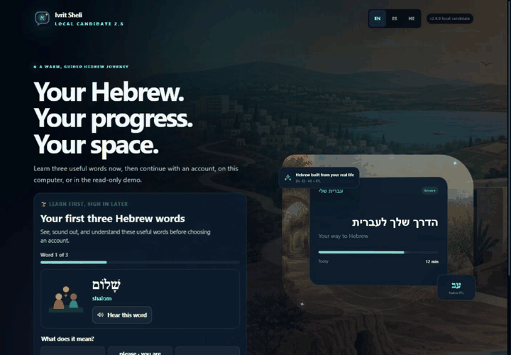
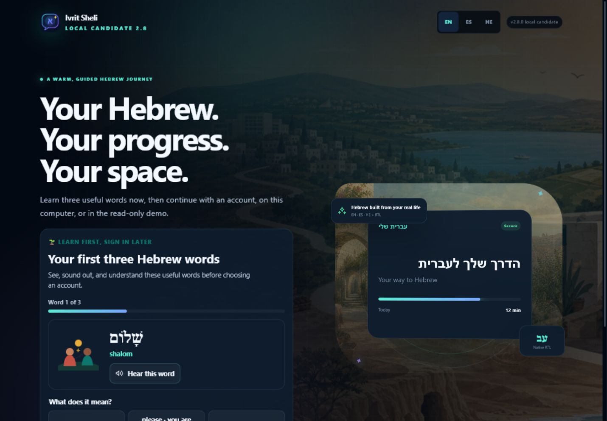
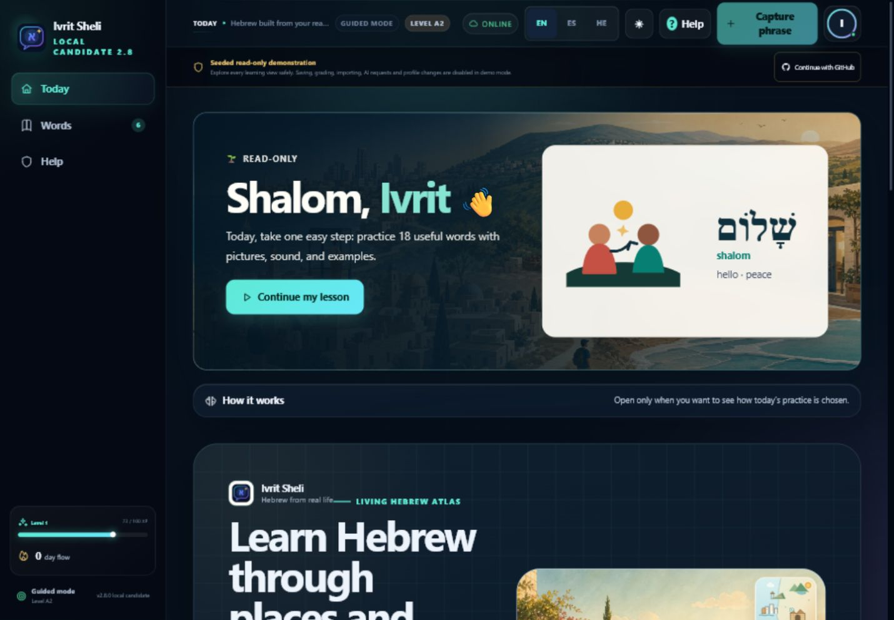
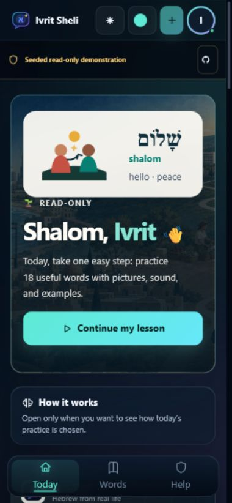
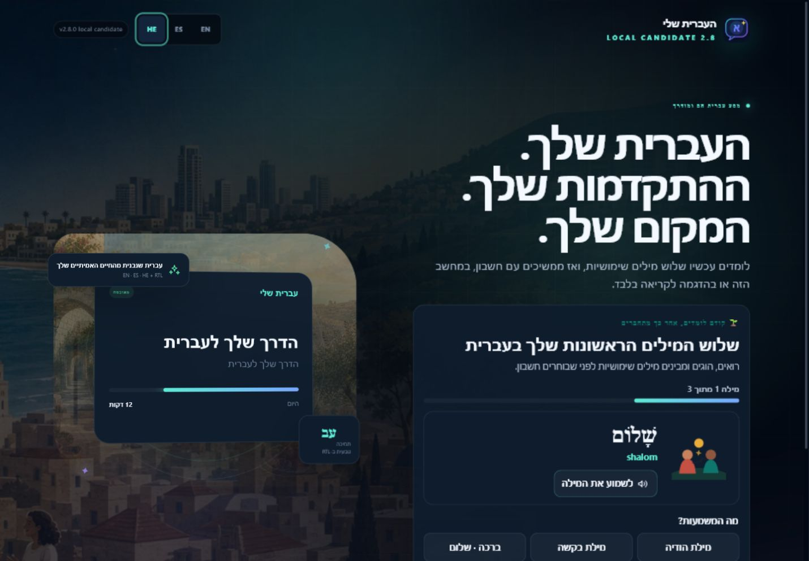

<div align="center">
  

  <h1>Ivrit Sheli 2.8.1 — Mother Pilot Polish · העברית שלי</h1>
  <p><strong>A beginner-first, evidence-informed Hebrew journey that grows with the learner.</strong></p>

  <p>
    <code>Hebrew • English • Spanish</code> ·
    <code>SQLite + PostgreSQL</code> ·
    <code>Google identity + local mode</code> ·
    <code>Docker</code> ·
    <code>Deterministic learning engine</code> ·
    <code>RTL-native</code> ·
    <code>Accessible motion</code>
  </p>

  <p>
    
    
    
  </p>
</div>

<p align="center">
  <a href="https://ivritsheli-production.up.railway.app/?lang=en"><strong>🌐 Open the verified Ivrit Sheli 2.4.0 Contest Edition</strong></a>
</p>

> **Release-candidate boundary:** this checkout is the local, unpublished 2.8.1 candidate. The Railway deployment, public Git tag and GitHub Release intentionally remain on the verified 2.4.0 Contest Edition until the full release gate and formal mother-pilot acceptance retest are approved.

### Source and live release truth

| Surface | Verified state |
|---|---|
| Current private source checkout | `2.8.1` · Mother Pilot Polish candidate · not deployed or published |
| Current public deployed application | `2.4.0` |
| Release implementation commit | `03bf84b9268ff8be528c0fab3c670f9652ee23b0` |
| Production storage/readiness | PostgreSQL · ready · 48 reviewed dictionary entries |
| Deployment verification | Successful on 2026-07-21 |
| Release verification | 151 unique backend tests + 62 frontend tests = 213 passed; main CI and CodeQL passed |
| Candidate verification | 195 backend + 158 Vitest + 21 Playwright = 374 executed passes; Ruff, strict MyPy, TypeScript, Vite, dependency audits, Docker/PostgreSQL, tenant isolation, disposable backup/restore and the 136-file/277-checksum staged-tree gates are verified |
| GitHub publication | [`v2.4.0`](https://github.com/LiriothTeltanion/IvritSheli/releases/tag/v2.4.0) is the published tag and GitHub Release |
| Live account evidence | Identity-only Google sign-in, onboarding state and the authenticated session persisted across reload; logout returned to the English landing page and remained signed out after reload |
| Live judge-path evidence | The English entry link and four-stop read-only guided tour passed production browser checks |
| Remaining v2.8 release gate | Two-real-Google-account isolation/persistence, the formal mother-pilot acceptance retest and the end of the active Devpost judging freeze remain required before public release |
| Visual proof | The animated journey and desktop/mobile/RTL captures below were generated from the local 2.8.0 candidate after Docker rebuild and direct browser inspection |

The same conservative fields are available for portfolio/profile tooling in
[`portfolio/project.json`](portfolio/project.json). The creative and product
principles behind this release live in the
[`Ivrit Sheli product manifesto`](docs/PRODUCT_MANIFESTO.md).

<p align="center">
  
</p>

<details>
<summary><strong>🌤️ Open the local 2.8 beginner, mobile and Hebrew RTL views</strong></summary>

<table>
  <tr>
    <td width="50%" align="center"><strong>Learn before account</strong></td>
    <td width="50%" align="center"><strong>Guided desktop journey</strong></td>
  </tr>
  <tr>
    <td></td>
    <td></td>
  </tr>
  <tr>
    <td width="34%" align="center"><strong>390 px mobile</strong></td>
    <td width="66%" align="center"><strong>Hebrew right-to-left</strong></td>
  </tr>
  <tr>
    <td></td>
    <td></td>
  </tr>
</table>
</details>

> **Screenshot boundary:** these images show the unpublished local 2.8.0 candidate, not the frozen 2.4.0 contest deployment. They are prepared for the future release and will not be pushed while Devpost judging is active.

## Why this project exists 💙

Most language products make every learner follow the same path. Ivrit Sheli does the opposite: it converts the Hebrew you encounter at work, in Be'er Sheva, in messages, appointments, media, and daily conversations into an evolving personal curriculum.

The system tracks what you recognize, what you can produce, where you hesitate, which grammar errors repeat, which situations matter, and which learning mode works best. Recommendations are explainable: the app tells you *why* it selected a word, exercise, mission, or speaking drill.

## What the private 2.8.1 candidate delivers 🌤️

The 2.8.1 Mother Pilot Polish slice responds to real Samsung use: a shared
local link creates a separate learner identity, all pronunciation paths speak
canonical continuous Hebrew (including `בבקשה`), the five First Steps scenes
use one warmer exact-sense visual grammar, Settings remains reachable in Guided
mode, and **Finish for today** gives non-technical learners a safe web/PWA
ending without pretending to close the browser or sign them out.

The first useful interaction happens before registration: a new learner sees and reads **three practical Hebrew words**, then can choose local use, the read-only demo or identity-only Google sign-in. **Guided/A0** is the safe default. Guided keeps the main journey to Today, Words and Help; Explorer exposes more choice; Experienced opens the complete workspace without changing the learner's language level.

The deterministic `LocalLearningEngine` plans the same learning contract across Today, the curriculum path, daily practice, recommendations and progress. It uses reviewed linguistic content, SRS urgency, mistakes, confidence, response time and exposure history. It does not call an LLM, infer an accent score or turn XP into mastery. The structured path covers **A0, A1 and A2**; **B1/B2 Lab** is clearly experimental material, not a claim of a complete B2 course.

Daily practice is resumable and persisted as:

```text
encounter → 3–5 retrievals by mode/content → listening → speaking/manual fallback → reflection → summary
```

Each step records `completed`, `failed` or `unsupported`, while a client idempotency key prevents duplicate evidence. The reviewed starter dictionary now contains **240 trilingual concepts**: the 144-concept A0/A1 foundation plus 96 reviewed A2 concepts. Stable `visual_id` values, trilingual alternative text and reviewed `reading_hints` support visual learning without removing niqqud mechanically.

The interface follows an original six-stop Israel journey—Galilee, Haifa/Carmel, Tel Aviv/Jaffa, Jerusalem, the Dead Sea and the Negev—with warm local artwork, twelve category illustration grammars, progressive visual hints and reduced-motion fallbacks. Persistent masculine/feminine-style browser voice and slow/normal speed preferences support listening practice; local recording and manual fallback remain available without claiming phoneme or accent assessment.

The PWA caches its shell, six region scenes and reviewed starter dictionary, but never caches private API responses. Offline reference browsing remains available after those assets have been cached; cloud writes stop honestly and ask the learner to reconnect. Local SQLite still works without an account. Cloud continuity uses isolated PostgreSQL learner snapshots, while Google sign-in requests only `openid profile`—never Gmail, Drive or Calendar.

## Private 2.7.0 checkpoint — beginner-first continuity

The unpublished v2.7 checkpoint established the three-words-before-account entry, Guided/A0 defaults, the simplified Guided navigation, permanent Help access, real network status and an accessible profile menu. It also introduced the deterministic daily planner, resumable practice tables, curriculum progress, idempotent step events, profile text scaling and focus status. These foundations are incorporated into the current v2.8 candidate; v2.7 was not deployed, tagged or published.

## Historical 2.6.0 Learning Core 🧠

Version 2.6 converts the private-pilot foundation into one explicit learning contract: **contextual encounter → unassisted retrieval → reference feedback/self-correction → corrected retry → delayed review → transfer → reflection**. Exposure, answer reveals, XP and AI output do not count as mastery. The server owns phase transitions and derives the practiced skill, while the interface explains why an activity appeared and when it returns. Correctness and confidence are explicitly learner-reported in this pilot; they are not presented as objective language scoring.

The learner model now separates curriculum-track preference, a self-selected pragmatic CEFR-aligned planning band and interface experience. **Guided**, **Explorer** and **Experienced** change interaction density without silently changing the planning band. Version 2.6 keeps one shared due queue until items have reviewed track and level metadata; it does not pretend those preferences already provide a complete adaptive syllabus. Skill evidence is tracked across recognition, production, listening, speaking, pointed reading, unpointed reading and contextual transfer. Reading assistance follows a per-concept ladder from full niqqud to linguistically reviewed `reading_hints`, hint-only support and everyday unpointed Hebrew; it never removes vowels by character position. The ladder advances only after repeated unassisted evidence, restores a rung after a lapse and remains unchanged when reviewed support is unavailable.

The Today journey and progress map expose honest loading, unavailable, degraded and insufficient-evidence states. Delayed-retention checkpoints at 24 hours, 7 days and 30 days remain empty until enough qualified observations exist. The deterministic local fallback can demonstrate the lesson structure when the new endpoint is unavailable, but it never pretends to save server progress.

Each writable activity also carries a server-owned state token and a bounded idempotency key. Exact retries return the original result without advancing twice; stale tabs or devices receive a conflict and reload the current activity. The private build must remain isolated from the live 2.4 learner-state writer until the backup and single-writer transition in [`docs/DEPLOYMENT.md`](docs/DEPLOYMENT.md) is approved.

The research and content policy are documented in [`docs/LEARNING_SCIENCE.md`](docs/LEARNING_SCIENCE.md), [`docs/LEARNING_CORE_V2_6.md`](docs/LEARNING_CORE_V2_6.md), [`docs/HEBREW_CONTENT_PROVENANCE.md`](docs/HEBREW_CONTENT_PROVENANCE.md) and the traced [`docs/COMPETITIVE_BENCHMARK_2026.md`](docs/COMPETITIVE_BENCHMARK_2026.md) decision ledger. These documents grade evidence, record licensing boundaries and explicitly reject CEFR certification, opaque AI mastery, engagement-as-learning and unvalidated Hebrew phoneme or accent claims.

## Foundation completed in the 2.5.0 Private Pilot 🗺️

Version 2.5 introduces three persisted learner experiences with real behavior differences: **Guided** simplifies navigation and keeps First Steps prominent, **Explorer** opens independent adaptive practice and the AI Coach, and **Experienced** exposes the complete toolset and connections with less compulsory guidance. Existing profile choices migrate conservatively.

The learning journey now uses an original Israel-wide visual atlas across Galilee, Haifa/Carmel, Tel Aviv/Jaffa, Jerusalem, the Dead Sea and the Negev. A warm editorial illustration adds depth to the authentication and dashboard surfaces, while reading content remains on nearly opaque cards with high-contrast and reduced-motion fallbacks. The Negev is one meaningful stop, not the app's entire visual identity.

The reviewed starter dictionary grows from 48 to exactly **96 trilingual concepts** across eight balanced categories. The private pilot also expands the achievement journey from 6 to 15 milestones and adds a learner-visible activity log for captures, reviews, pronunciation, missions and XP. AI and connector access remains consent- and cost-gated; Google-authenticated pilot users can be allowlisted by immutable provider subject without expanding identity-only sign-in into Gmail, Drive or Calendar access.

The 2.5 foundation was preserved locally at commit `36c9791` after 157 backend tests, 74 frontend tests, Ruff, strict MyPy, TypeScript, the Vite build and the 75-file package verifier passed. It was not deployed, tagged or pushed; v2.6 continues from that private checkpoint.

## What changed in the 2.4.0 Contest Edition 🧭

Version 2.4 adds a four-stop guided tour to the synthetic read-only demo. It navigates through an ephemeral illustrated First Steps lesson, visual dictionary, microphone word intelligence and adaptive progress without mutating shared demo data. A per-visit `?lang=en`, `?lang=es` or `?lang=he` override makes judge links and support captures deterministic without replacing a learner's saved language.

The tour is built from the existing icon, motion, responsive, RTL and reduced-motion systems rather than a new visual dependency. On the security boundary, bearer/session/OAuth-state digests move to keyed BLAKE2b-256 while retaining their 64-character hexadecimal storage contract. Deployment intentionally rotates active session hashes. Google remains identity-only; 2.4 adds no Gmail, Drive or Calendar scope, provider, schema or dependency.

These Contest Edition changes were implemented at commit `03bf84b9268ff8be528c0fab3c670f9652ee23b0`, are deployed on Railway as version `2.4.0`, and are published in tag and GitHub Release [`v2.4.0`](https://github.com/LiriothTeltanion/IvritSheli/releases/tag/v2.4.0).

## Foundation inherited from the unreleased 2.3.0 candidate 🌤️

Version 2.3 introduces a warm, light-first beginner journey built for learners who may be new to both Hebrew and technology. A short onboarding flow records level, interface language, learning goal and daily pace, then leads into a five-word first lesson using `שלום`, `תודה`, `בבקשה`, `כן` and `לא`. Onboarding, the current First Steps checkpoint and lesson completion are learner-profile state, so they persist in private SQLite or the authenticated PostgreSQL account instead of relying on browser-only storage. Existing learners bypass beginner onboarding without losing their exact saved level. The guided-mode preference is stored, but a distinct simplified/full-shell behavior remains a candidate follow-up.

The bundled dictionary now contains exactly 48 reviewed A0/A1 visual concepts across greetings, family, home, food, transport, shopping and health. Each concept carries stable code-native visual metadata, accessible Hebrew/English/Spanish alternative text, niqqud, romanization, meanings and a practical trilingual example. Google identity-only sign-in is the beginner-facing option when configured, while GitHub remains available; both use provider-bound single-use state and S256 PKCE, and neither stores provider bearer tokens or email addresses. Settings adds learner-data export and a two-step authenticated account deletion action.

The 2.3 candidate was never tagged or published; its completed beginner journey is incorporated into the live 2.4.0 Contest Edition.

## What changed in 2.2.0 🎙️

Version 2.2.0 turns pronunciation and vocabulary history into richer daily learning tools. Learners can keep a device-persisted masculine-style or feminine-style synthetic voice profile, record exactly one Hebrew word, and receive clearly sourced dictionary facts with English/Spanish meanings, grammar, forms, examples and optional consent-gated AI enrichment. Microphone permission is user-triggered, app-managed word-analysis uploads are temporary, and transcripts cannot award XP or change mastery.

The new saved-vocabulary registry makes every saved item searchable and filterable by status or review timing, with sorting, review counts, saved/activity dates and separate recognition, production, listening and speaking mastery. The dictionary now shows learning state, preserves homograph identity and atomically prevents new duplicate additions. Existing duplicate dictionary rows created before 2.2 are intentionally not auto-merged because their review histories need conservative reconciliation. A vector-only visual upgrade adds deeper surfaces, Hebrew letter constellations, refined navigation and restrained responsive motion while preserving RTL, high contrast and a fully stationary reduced-motion experience.

## What changed in 2.1.1 🔐

The 2.1.1 release was a focused safety, correctness, and accessibility update. Cloud AI and audio require stored learner consent before provider work begins; future reviews stay out of the due queue; dictionary readiness fails closed; SQLite upgrades run as atomic ordered migrations; and pronunciation history is recorded without letting an unverified client transcript change speaking mastery or XP.

The review experience also behaves correctly with keyboards, screen readers, and reduced-motion preferences. Quick capture and dictionary dialogs trap and restore focus, hidden answer controls cannot be reached early, and recorded audio preserves its real MIME type and transcription-provider context. This release was merged and deployed before 2.2.0 and remains historical production evidence.

## What changed in 2.1 🚆

Version 2.1 established the Railway production path at [ivritsheli-production.up.railway.app](https://ivritsheli-production.up.railway.app). The HTTPS application, liveness, PostgreSQL-backed readiness, immutable release identity, structured startup/health logs, and seeded read-only demo were verified in production. GitHub OAuth reaches GitHub's consent screen and cancellation returns safely to the app; the final authorization-code exchange and authenticated-session flow remain explicitly unclaimed until completed in a normal browser.

## What changed in 2.0 🚀

Version 2.0 turns the complete local-first learning system into a deployment-ready, production-shaped full-stack product without sacrificing its private offline path.


| Production capability | Verifiable implementation |
|---|---|
| Authentication | Google OpenID Connect or GitHub OAuth with provider-bound state, S256 PKCE, short-lived single-use attempts and keyed BLAKE2b-hashed server-side sessions |
| Session security | Random bearers stored only as hashes; `HttpOnly`, `Secure`, `SameSite` cookies; logout revocation |
| Demo boundary | Deterministic non-admin tenant with seeded data and server-enforced read-only mutations |
| PostgreSQL | Users, sessions, OAuth state and one revisioned JSONB learner snapshot per authenticated user |
| Authorization | Request-derived identity, explicit tenant predicates and forced PostgreSQL row-level security under a restricted runtime role |
| Migrations | Alembic plus an idempotent provisioner; privileged migration and restricted runtime DSNs are separate |
| Containers | Multi-stage React/Python image, unprivileged runtime user, health check and persistent Compose volumes |
| Integration tests | Real PostgreSQL migration, persistence, session, cross-user isolation and RLS denial—not SQLite mocks |
| Observability | One redacted JSON log per completed request with correlation ID, status, duration, version and build commit |
| Operations | Independent liveness, readiness and immutable version endpoints plus explicit rollback/restore guidance |

The public-demo design does not contain Kevin's private learning history: it uses synthetic seeded phrases and cannot permanently mutate shared state. Paid AI and Kevin's Google Workspace connector credentials remain separate from identity-only Google sign-in and must stay disabled until their identity allowlists and cost controls are explicitly verified.

## What is included

| Area | Included implementation |
|---|---|
| Learning | Beginner-first entry, structured A0–A2 path, honest B1/B2 Lab, resumable six-format daily practice, reviews, missions and reflection |
| Personalization | Shared deterministic `LocalLearningEngine`, SRS urgency, mistake taxonomy, confidence, latency, exposure and explainable selection |
| AI | The public learning path requires no LLM; the existing OpenAI adapter remains disabled and experimental for a future consent/cost review |
| Dictionary | 240 reviewed visual A0–A2 concepts, clickable Hebrew, trilingual meanings/examples, grammar/forms/provenance, `visual_id`, reviewed reading hints and learned state |
| Word registry | Tenant-scoped search, status/due filters, sorting, review history, dates and four-skill mastery |
| Full lexicon | One-command importer for the current Kaikki/Wiktionary Hebrew JSONL dataset |
| Audio | Persistent masculine/feminine-style browser voice, slow/normal speed, local recording/playback and transcript comparison only when browser recognition exists |
| Gamification | XP and mastery kept separate, meaningful daily actions, rest-aware streaks, optional accessible celebrations and achievements without leagues or energy |
| Integrations | Identity-only Google sign-in (`openid profile`) for cloud continuity; local mode needs no account; Workspace connector adapters are outside the v2.8 public learning flow |
| Languages | Trilingual interface and content layers: Hebrew, English, Spanish |
| UI | Warm illustrated Israel journey, three learner experiences, first three words before account, responsive RTL/LTR, high contrast and reduced-motion support |
| Reliability | FastAPI error handling, request IDs, liveness/readiness/version probes, real PostgreSQL integration tests, CI |
| Privacy | Local SQLite mode, isolated PostgreSQL tenants, read-only public demo, no analytics, explicit cloud consent |

## Product loop


1. **Capture** a phrase, screenshot transcription, audio clip, or context.
2. **Understand** niqqud, transliteration, grammar, root, register, and examples.
3. **Practice** recognition, recall, listening, speaking, cloze, and free production.
4. **Use** the phrase in a practical mission.
5. **Reflect** on confidence and outcome.
6. The personal learner model updates recommendations without hiding the logic.

## Run locally

### Easiest Windows start 🟢

Double-click [`START_IVRIT_SHELI.bat`](START_IVRIT_SHELI.bat) in the project folder.

The launcher automatically:

- Installs dependencies when needed.
- Builds the latest interface.
- Creates and seeds the private local database on first launch.
- Keeps personal learning data in `%LOCALAPPDATA%\IvritSheli\data`, outside the OneDrive-synced source folder.
- Starts one private server bound to `127.0.0.1`.
- Opens Ivrit Sheli in your default browser.

Keep the launcher window open while using the app. Press `Ctrl+C` in that window to stop it safely; your progress remains stored locally. You can also launch it from PowerShell:

```powershell
.\scripts\start.ps1
```

The default address is `http://127.0.0.1:8000`. If that port is busy, the launcher selects the next available local port and opens the correct address automatically.

### Private phone pilot on the same Wi-Fi 📱

Double-click [`START_PRIVATE_PILOT.bat`](START_PRIVATE_PILOT.bat). It starts the writable local app on the first available port, detects the computer's LAN address and copies a Spanish link for WhatsApp.

During the test:

- Keep this computer, the launcher window and the Wi-Fi connection active.
- The phone and computer must use the same trusted Wi-Fi network.
- If Windows Firewall asks, allow Python only on **Private networks**, not Public networks.
- Progress is stored on this computer; this LAN pilot does not provide Google cross-device continuity.
- Stop the pilot with `Ctrl+C` when the session ends.
- Do not expose this temporary HTTP address to the public internet.

The printed link follows the form `http://<computer-LAN-IP>:<port>/?lang=es`. A normal public WhatsApp link with HTTPS and Google persistence will become appropriate only after the Devpost freeze and the two-account production gate.

### Requirements

- Python 3.10+
- Node.js 20.19+; Node.js 22 LTS is recommended
- npm 10+
- SQLite with FTS5 support

PostgreSQL is required only for authenticated cloud mode. Docker Compose provides PostgreSQL 17 automatically.

### One-command setup on macOS/Linux

```bash
./scripts/setup.sh
./scripts/run-dev.sh
```

Then open `http://127.0.0.1:5173`.

### Windows development mode

```powershell
.\scripts\setup.ps1
.\scripts\run-dev.ps1
```

Development mode uses hot reload and opens at `http://127.0.0.1:5173`.

### Manual setup

```bash
# Backend
python -m venv .venv
source .venv/bin/activate
pip install -r backend/requirements.txt
PYTHONPATH=backend/src python -m ivrit_sheli --init --seed
uvicorn ivrit_sheli.api:app --app-dir backend/src --reload --port 8000

# Frontend, in a second terminal
cd frontend
npm ci
npm run dev
```

### Docker

```bash
docker compose config --quiet
docker compose up --build --wait
```

Then open `http://127.0.0.1:8000` and enter the seeded read-only demo. Compose builds the React frontend, runs Alembic and provisions the direct least-privilege `ivrit_sheli_runtime` login against PostgreSQL 17, starts the non-root FastAPI container and waits for `/health/ready`.

```bash
curl http://127.0.0.1:8000/health/live
curl http://127.0.0.1:8000/health/ready
curl http://127.0.0.1:8000/version
```

The checked-in Compose secrets and separate administrator/runtime database passwords are local-development values only. Production variables and Railway deployment are documented in [`docs/DEPLOYMENT.md`](docs/DEPLOYMENT.md).

## Authentication and ownership 🔐

Local-first mode remains writable without an online account. Cloud mode requires an authenticated session and never accepts a client-supplied owner ID.

- **Google sign-in:** identity-only `openid profile`, provider-bound state + S256 PKCE, no Gmail/Drive/Calendar permission, and no stored email or bearer token.
- **GitHub sign-in:** secondary identity-only `read:user` OAuth, provider-bound state + S256 PKCE, and no repository permission.
- **Private sessions:** session and CSRF tokens are random; only their hashes are durable.
- **Bounded public surface:** layered client/global auth limits, per-user write and session caps, and a 4 MiB cloud-snapshot ceiling limit abuse and storage growth.
- **Tenant storage:** one PostgreSQL learner state per user with explicit ownership and forced RLS.
- **Read-only demo:** synthetic seeded data, no admin rights and `403` on private mutations.
- **Logout:** server-side revocation, not merely browser cookie removal.
- **Account control:** authenticated learners can export their state and permanently delete the account with an explicit two-step confirmation.
- **Cloud continuity:** the private SQLite launcher remains available when a hosting service is offline.

## Full Hebrew dictionary

The package contains a reviewed 240-concept A0–A2 starter layer so useful visual Hebrew works immediately. To install the broader machine-readable Hebrew dictionary:

```bash
source .venv/bin/activate
PYTHONPATH=backend/src python -m ivrit_sheli \
  --download-dictionary \
  --dictionary-url "https://kaikki.org/dictionary/Hebrew/kaikki.org-dictionary-Hebrew.jsonl"
```

Or import an existing file:

```bash
PYTHONPATH=backend/src python -m ivrit_sheli \
  --dictionary-jsonl data/imports/kaikki.org-dictionary-Hebrew.jsonl
```

The importer streams JSONL instead of loading it into memory. Entries retain provenance and license metadata. Every Hebrew token can open the dictionary; inflected forms and roots are cross-linked and clickable. Dictionary-derived content must keep its Wiktionary/Kaikki attribution and share-alike notices; see [`THIRD_PARTY_NOTICES.md`](THIRD_PARTY_NOTICES.md).

## AI boundary in 2.8

The v2.8 learning journey uses the deterministic local engine and reviewed linguistic data. It requires no API key, makes no per-learner model call and does not send pilot content to an external AI provider.

The repository retains consent-gated experimental OpenAI adapter contracts for later development, but the v2.8 interface keeps cloud AI disabled and `ALLOW_CLOUD_PROCESSING=false` remains the safe default. Those adapters are not presented as a released learning capability, and their provider/model configuration must be reviewed against current official documentation before a future opt-in experiment.

## Audio system

The v2.8 application supports:

1. **Browser speech synthesis** for zero-key Hebrew playback.
2. **Local recording and playback** through the browser media APIs.
3. **Browser speech recognition when available**, with a manual alternative when it is denied or unsupported.

Choose a persistent masculine-style or feminine-style synthetic profile and slow or normal speed. Browser playback selects a deterministic installed Hebrew voice plus a pitch fallback. These labels describe a synthetic presentation preference, not the identity or gender of a real speaker.

The microphone word-intelligence card accepts one Hebrew word from supported browser recognition or manual entry, then opens source-labelled dictionary meanings, translations, grammar, forms and examples. It does not claim accent or phoneme assessment, and a transcript cannot award XP or update mastery. Experimental cloud audio adapters remain disabled in the v2.8 pilot.

Recognition match is deliberately transparent. It compares normalized transcription, word coverage, sequence similarity, and omitted/extra words. It does **not** claim phoneme, accent, intelligibility, native-likeness or clinical accuracy.

## Personalization connectors

All connectors are disabled by default and read-only:

- **Calendar:** upcoming contexts can produce relevant phrase packs, such as medical, work, travel, or bureaucracy vocabulary.
- **Gmail:** only explicitly selected message snippets are converted into learning material.
- **Drive:** only explicitly selected documents are processed.
- **ICS:** local calendar files can be imported without a cloud connection.

The app stores connector state and consent inside the active learner boundary: local SQLite in private mode or that authenticated user's PostgreSQL tenant snapshot in cloud mode. See [`docs/CONNECTORS.md`](docs/CONNECTORS.md).

## XP and achievements

XP rewards language outcomes, not screen tapping.

| Action | Base XP |
|---|---:|
| Correct review | 10 |
| Difficult item mastered | 18 |
| Speaking attempt completed | 20 |
| Real-life mission completed | 50 |
| Reflection recorded | 12 |
| New phrase used successfully | 65 |
| Weekly plan completed | 100 |

Daily anti-grind limits reduce exploitative repetition. Streaks use grace rules and never punish Shabbat or a configured weekly rest period.

Implemented achievements (all 15):

- First Word / Pocket Dictionary / Word Garden — capture 1, 10 and 50 learning items.
- First Voice / Finding Your Voice / Voice Builder — complete 1, 10 and 25 speaking attempts.
- Curious Reader / Meaning Maker / Word Explorer — save 1, 25 and 100 distinct dictionary words.
- First Real Moment / Israel in Action — complete 1 and 10 real-life missions successfully.
- Three-Day Rhythm / Seven-Day Flow — sustain 3- and 7-day meaningful-practice streaks.
- Language Bridge / Three-Language Mind — use two, then all three, interface languages.

## Learning Core from the CLI

The local CLI exposes the same independent track, level and experience settings as the GUI:

```powershell
.\.venv\Scripts\python.exe -m ivrit_sheli `
  --set-curriculum-track modern_conversation `
  --set-cefr-band A1 `
  --set-learner-mode guided `
  --learning-core-status
```

Available track preferences are `modern_conversation`, `pointed_reading` and `formal_professional`; bands are the self-selected pragmatic `A0` onboarding state plus `A1`–`C2`; modes are `guided`, `explorer` and `experienced`. Selecting one dimension does not silently rewrite another. In this pilot, track and band are planning metadata while activity selection remains a shared due queue. The status command reports real persisted evidence and uses `insufficient_evidence` rather than manufacturing retention percentages.

## Test everything

The locally verified 2.4.0 source passes **151 unique backend tests + 62 frontend tests = 213 passing automated tests**. The ordinary backend run reports 150 passed and one credential-gated PostgreSQL skip; the dedicated PostgreSQL 17 gate passes all three database-boundary tests, two already represented in the ordinary suite and one replacing that skip. Ruff, strict MyPy across 24 source files, compileall, offline doctor, pip-audit, TypeScript, Vite, npm production audit, package verification and the production-shaped Docker/Compose smoke all pass locally. Separately, Railway production reports 2.4.0 with PostgreSQL and all 48 reviewed dictionary entries ready; the English judge path, identity-only Google sign-in, onboarding/session persistence across reload and logout were verified in a normal browser.

```bash
./scripts/test-all.sh
```

Or separately:

```bash
PYTHONPATH=backend/src pytest backend/tests -q
cd frontend && npm test -- --run
cd frontend && npm run build
docker compose up --build --wait
```

External APIs are tested through deterministic HTTP fakes. Live credentials are never required for CI. Use the explicit opt-in smoke test after adding credentials:

```bash
PYTHONPATH=backend/src python -m ivrit_sheli --doctor --live
```

See [`TEST_REPORT.md`](TEST_REPORT.md) for the commands and results produced for this package.

## Repository map

```text
IvritSheli/
├── .github/                    # CI and dependency-update automation
├── assets/                     # Brand, README art, achievement badges
├── backend/
│   ├── src/ivrit_sheli/        # API, engines, repositories, connectors, CLI
│   ├── migrations/             # Versioned PostgreSQL Alembic schema
│   └── tests/                  # Unit and integration tests
├── frontend/
│   ├── public/                 # PWA manifest and app icon
│   └── src/                    # React + TypeScript UI
├── data/                       # Local databases, imports, audio, backups
├── docs/                       # Detailed product and engineering guides
├── scripts/                    # Setup, run, test, and verification scripts
├── Dockerfile
├── docker-compose.yml
├── railway.toml                # Deployment, migration and health policy
├── Makefile
├── PRIVACY.md                  # Hosted-service privacy notice
├── TERMS.md                    # Hosted-service terms of use
└── README.md
```

## Documentation

- [`docs/ULTIMATE_BUILD_SPEC.md`](docs/ULTIMATE_BUILD_SPEC.md) — complete product instructions and acceptance criteria.
- [`docs/ARCHITECTURE.md`](docs/ARCHITECTURE.md) — boundaries, data flow, schema, and failure modes.
- [`docs/AI_ENGINE.md`](docs/AI_ENGINE.md) — provider design, schemas, fallback, and learner feedback loop.
- [`docs/DICTIONARY.md`](docs/DICTIONARY.md) — import pipeline, clickable Hebrew, provenance, and licensing.
- [`docs/AUDIO.md`](docs/AUDIO.md) — recording, TTS, STT, scoring, and privacy.
- [`docs/GAMIFICATION.md`](docs/GAMIFICATION.md) — XP economy, achievements, streaks, and anti-abuse rules.
- [`docs/PERSONALIZATION.md`](docs/PERSONALIZATION.md) — learner model and explainable recommendations.
- [`docs/COMPETITIVE_BENCHMARK_2026.md`](docs/COMPETITIVE_BENCHMARK_2026.md) — traced Adopt/Adapt/Avoid/Experiment decisions from competitor research and real beginner feedback.
- [`docs/DESIGN_SYSTEM.md`](docs/DESIGN_SYSTEM.md) — colors, icons, animation, RTL, and accessibility.
- [`docs/CONNECTORS.md`](docs/CONNECTORS.md) — Google/ICS setup and consent rules.
- [`docs/API.md`](docs/API.md) — endpoint catalog.
- [`docs/DEPLOYMENT.md`](docs/DEPLOYMENT.md) — local, Docker, and production hardening.
- [`docs/USER_GUIDE.md`](docs/USER_GUIDE.md) — complete learner and administrator workflow.
- [`docs/DEMO_DAY.md`](docs/DEMO_DAY.md) — fallback demo flow and live presentation plan.
- [`docs/VIDEO_SCRIPT.md`](docs/VIDEO_SCRIPT.md) — reviewed under-three-minute Build Week narration, storyboard, and claim boundaries.
- [`docs/BUILD_WEEK.md`](docs/BUILD_WEEK.md) — pre-existing product foundation, v2.3 sprint, v2.4 contest finish, AI collaboration and evidence boundaries.
- [`PACKAGE_MANIFEST.md`](PACKAGE_MANIFEST.md) — exact release contents and credential boundaries.
- [`TEST_REPORT.md`](TEST_REPORT.md) — commands, results, and honest limitations.
- [`SECURITY.md`](SECURITY.md) — session, tenant, logging, secret-management, reporting, and incident controls.
- [`PRIVACY.md`](PRIVACY.md) — learner data, sign-in, microphone and account-control policy.
- [`TERMS.md`](TERMS.md) — public pilot terms and educational limitations.

## Privacy promise 🔒

- No account required for private local-first mode.
- Cloud identities are limited to the selected provider's user ID plus display name, avatar and GitHub login when applicable; Google email and all provider bearer tokens are excluded from durable identity records.
- Public demo content is synthetic, tenant-isolated and read-only.
- No advertising or behavioral analytics.
- No secret keys in frontend code.
- No cloud synchronization by default.
- No automatic email/document ingestion.
- Learner data can be exported as JSON; the 2.4 deployment includes authenticated two-step self-service cloud-account deletion.
- External requests are labeled before content leaves the device.

## Project status

Version 2.4.0 is live at [ivritsheli-production.up.railway.app](https://ivritsheli-production.up.railway.app/?lang=en) and published as Git tag and GitHub Release [`v2.4.0`](https://github.com/LiriothTeltanion/IvritSheli/releases/tag/v2.4.0). The release implementation at `03bf84b9268ff8be528c0fab3c670f9652ee23b0` deployed successfully on 2026-07-21; later release-evidence and documentation commits do not change the application version. PostgreSQL readiness and all 48 reviewed dictionary entries passed. The English entry, read-only guided tour, identity-only Google sign-in, onboarding/session persistence across reload, logout and signed-out persistence after reload were verified in a normal browser. Re-login after logout, live GitHub authorization, live OpenAI or Google Workspace connector calls, two-real-user production isolation, refreshed 2.4 mobile/RTL/reduced-motion screenshots and backup restoration remain separate unclaimed operator checks.

Passing tests and healthy local production-image checks materially reduce risk but do not prove that software is defect-free. Operational limits, credential-dependent checks and restore requirements are documented explicitly rather than hidden behind a perfect-score claim.

## License

Application source code and Ivrit Sheli UI graphics: MIT. Dictionary-derived data uses separate Wiktionary/Kaikki terms. The personal `KC ✦ LT` identity mark is reserved and excluded from the MIT asset grant. See [`LICENSE`](LICENSE) and [`THIRD_PARTY_NOTICES.md`](THIRD_PARTY_NOTICES.md).

<div align="center">
  
  <p><sub>Designed, engineered and signed by Kevin Cusnir · Lirioth Teltanion 💙</sub></p>
</div>
